```mermaid
graph TD
    US001[US-001: Title] --> US002[US-002: Title]
    US001 --> US003[US-003: Title]
    US002 --> REVIEW1[🚧 US-REVIEW-S1]
    US003 --> REVIEW1
    REVIEW1 --> US004[US-004: Title]
```

```mermaid
graph TD
    US001[US-001: Create validators module] --> US002[US-002: Add error messages]
    US001 --> US003[US-003: Add integration helper]
    US002 --> REVIEW1[🚧 US-REVIEW-S1]
    US003 --> REVIEW1
```

# PRD-Tasks Generator

Create Product Requirements Documents with prescriptive, command-level implementation details optimized for autonomous AI execution via the Ralph loop.

**Key Difference from /prd:** This format uses TASKS.md-style prescriptive details instead of abstract user stories, dramatically reducing AI hallucination.

---

## The Job

1. Receive a feature description from the user
2. Ask 3-5 essential clarifying questions (with lettered options)
3. Generate a structured PRD with prescriptive implementation specs
4. Save to `PRD_<NAME>.md`
5. Create empty `progress_<name>.txt`

**Important:** Do NOT start implementing. Just create the PRD.

---

## Step 1: Clarifying Questions

Ask only critical questions where the initial prompt is ambiguous. Focus on:

- **Problem/Goal:** What problem does this solve?
- **Core Functionality:** What are the key actions?
- **Scope/Boundaries:** What should it NOT do?
- **Technical Context:** What files/modules exist already?

### Format Questions Like This:

```
1. What is the primary goal?
   A. Add new feature X
   B. Fix bug in Y
   C. Refactor Z
   D. Other: [please specify]

2. Where should this code live?
   A. New file (specify name)
   B. Existing file: src/foo.py
   C. Multiple files
   D. Not sure - need exploration first
```

This lets users respond with "1A, 2B" for quick iteration.

---

## Step 2: Story Sizing (THE NUMBER ONE RULE)

**Each story must be completable in ONE context window (~10 min of AI work).**

Ralph spawns a fresh instance per iteration with no memory of previous work. If a story is too big, the AI runs out of context before finishing.

### Right-sized stories (~10 min):
- Add a single function with tests
- Add one CLI subcommand
- Update one file with specific changes
- Add validation to existing function

### Too big (MUST split):
| Too Big | Split Into |
|---------|-----------|
| "Build the dashboard" | Schema, queries, UI components, filters |
| "Add authentication" | Schema, middleware, login UI, session handling |
| "Refactor the API" | One story per endpoint |

**Rule of thumb:** If you cannot list exact file changes in 3-5 bullet points, it's too big.

---

## Step 3: Prescriptive Implementation Specs (CRITICAL)

**This is what makes prd-tasks different from prd.**

Each story must include:
1. **Exact file paths** to create or modify
2. **Size/complexity targets** (~10 lines, ~5 functions)
3. **Approach section** with HOW to implement and what NOT to do
4. **Specific commands** to run for verification
5. **Expected outputs** so AI knows success criteria
6. **Time estimate** to calibrate scope

### WRONG (vague, invites hallucination):
```markdown
### US-001: Add user validation [ ]
**Description:** As a developer, I want to validate user input.

**Acceptance Criteria:**
- [ ] Validate email format
- [ ] Validate password strength
- [ ] Tests pass
- [ ] Typecheck passes
```

### CORRECT (prescriptive with TDD embedded, ralph.sh-compatible format):
```markdown
## Sprint 1: User Validation (~20 min)
**Status:** NOT STARTED

- [ ] **US-001** Create validators module with tests (~15 min, ~45 lines)
- [ ] **US-REVIEW-S1** Sprint 1 Review (~5 min)

---

### US-001: Create validators module with tests (~15 min, ~45 lines)

**Implementation:**
- Files: `src/validators.py` (create new) + `test/test_validators.py` (create new)
- Functions: `validate_email(email: str) -> bool`, `validate_password(password: str) -> tuple[bool, str]`
- Tests: 6+ test cases covering valid/invalid scenarios
- Target: ~15 lines production code + ~30 lines test code

**Approach (TDD RED-GREEN-VERIFY):**
1. **RED Phase (~5 min):**
   - Create `test/test_validators.py`
   - Import from `src.validators` (will fail - module doesn't exist yet)
   - Write 6+ test cases (test_valid_email, test_invalid_email_no_at, test_invalid_email_no_dot, etc.)
   - Run: `pytest test/test_validators.py -v`
   - Expected: ImportError or all tests fail (RED status confirmed)

2. **GREEN Phase (~8 min):**
   - Create `src/validators.py`
   - Implement validate_email() - check for `@` with text before and `.` after
   - Implement validate_password() - check len >= 8, any(c.isupper()), any(c.isdigit())
   - Run: `pytest test/test_validators.py -v`
   - Expected: All 6+ tests pass (GREEN status)

3. **VERIFY Phase (~2 min):**
   - Temporarily break validate_email (e.g., return False always)
   - Run: `pytest test/test_validators.py -v`
   - Expected: Tests fail (RED - proves tests catch bugs)
   - Fix validate_email back to correct implementation
   - Run: `pytest test/test_validators.py -v`
   - Expected: Tests pass (GREEN - verified)

**Functional Programming Requirements:**
- Pure functions: No side effects, deterministic output
- Do NOT use regex for email (keep simple)
- Do NOT validate email domain exists (out of scope)
- Do NOT check password against common passwords list

**Acceptance Criteria:**
- RED: Test file created with imports from non-existent module
- GREEN: Both test and production files exist, all tests pass
- VERIFY: Breaking code causes tests to fail, fixing makes them pass
- Run: `mypy src/validators.py`
- Expected: exit code 0
```

**Key format rules for ralph.sh compatibility:**
1. Sprint checklist uses: `- [ ] **US-XXX** Title (~X min)`
2. Detailed sections use: `### US-XXX: Title` (NO checkbox - avoids double-counting)
3. Acceptance criteria use plain bullets (NO `[ ]` checkboxes)
4. Each sprint has `**Status:** NOT STARTED` line

---

## Step 4: Include Exact Commands

Every acceptance criterion that involves verification must include:
1. The exact command to run
2. The expected output or exit code

### Command Templates:

**For tests:**
```markdown
- [ ] Run: `pytest test/test_foo.py -v`
- [ ] Expected: All tests pass (exit 0)
```

**For typecheck:**
```markdown
- [ ] Run: `mypy src/foo.py --strict`
- [ ] Expected: "Success: no issues found"
```

**For file creation:**
```markdown
- [ ] Run: `ls -la src/validators.py`
- [ ] Expected: File exists with size > 0
```

**For function verification:**
```markdown
- [ ] Run: `python -c "from src.validators import validate_email; print(validate_email('test@example.com'))"`
- [ ] Expected: `True`
```

**For database:**
```markdown
- [ ] Run: `python -c "from models import User; print([c.name for c in User.__table__.columns])"`
- [ ] Expected: List includes 'email', 'password_hash'
```

---

## Step 5: Story Ordering (Dependencies First)

Stories execute in order. Earlier stories must NOT depend on later ones.

**Correct order:**
1. Create module/file structure
2. Add core functions/classes
3. Add functions that use core functions
4. Add CLI/UI that calls the functions
5. Add integration tests

**Wrong order:**
```
US-001: CLI command (depends on function that doesn't exist!)
US-002: Core function
```

---

## Step 5b: PRD Format v2 Features

**PRD Format v2** adds metadata and visualization features to improve task tracking, dependency management, and progress monitoring.

### Tier 1: High Impact Features

**1. Dependency Metadata**
- Add `[depends: US-XXX]` to tasks that require other tasks to complete first
- Prevents gate violations (executing tasks before their dependencies)
- Helps ralph.sh or humans understand execution order
- Example: `- [ ] **US-003** Add CLI integration (~10 min) [depends: US-001, US-002]`

**2. Gate Indicators**
- Mark review tasks with `🚧 GATE` to highlight quality checkpoints
- Visual signal that execution blocks here until review passes
- Example: `- [ ] **US-REVIEW-S1** Sprint 1 Review 🚧 GATE (~5 min)`

**3. Task Summary Section**
- Placed after Goals, before first sprint
- Provides at-a-glance overview of total work
- Updated automatically as tasks complete (by humans or scripts)
- Shows: total tasks, estimated time, progress %, status, next task

### Tier 2: Medium Priority Features

**4. Progress Tracking Metadata**
- Record actual completion data when marking tasks done
- Format: `- [x] **US-XXX** [actual: Y min, agent: Z, YYYY-MM-DD HH:MM]`
- Enables time tracking, velocity analysis, agent attribution
- Example: `- [x] **US-001** [actual: 12 min, agent: claude-sonnet-4, 2026-02-11 14:30]`

**5. Dependency Graph**
- Optional mermaid diagram showing task relationships
- Visualizes dependencies, parallelization opportunities, gate positions
- Recommended for PRDs with 6+ tasks
- Helps humans and AI understand task flow at a glance

### Benefits

**For Autonomous Execution (ralph.sh):**
- Dependencies prevent executing tasks out of order
- Gate indicators signal when to pause for review
- Progress metadata enables learning from execution patterns

**For Human Review:**
- Task summary provides quick status overview
- Dependency graph shows project structure visually
- Progress metadata tracks actual vs estimated time

**For Parallel Execution:**
- Dependency metadata identifies which tasks can run concurrently
- Clear blocking relationships prevent race conditions

### Backward Compatibility

- v2 features are additive - v1 PRDs still valid
- ralph.sh scripts parse v2 metadata but work without it
- Human-friendly even if tooling doesn't parse metadata

### Dependency Metadata Guidelines

**When to Add Dependencies:**
- Task B modifies files created by Task A → `[depends: US-A]`
- Task C calls functions defined in Task A → `[depends: US-A]`
- Task D tests integration of Tasks A and B → `[depends: US-A, US-B]`
- Review task depends on all tasks in its scope → (implicit, no depends needed)

**When NOT to Add Dependencies:**
- Tasks that create independent files (can run in parallel)
- Tasks in different modules with no shared code
- Sequential ordering for readability only (not technical requirement)

**Example Dependency Patterns:**

```markdown
# Pattern 1: Foundation → Extension
- [ ] **US-001** Create core module (~10 min)
- [ ] **US-002** Add helper functions (~5 min) [depends: US-001]
- [ ] **US-003** Add validation (~5 min) [depends: US-001]

# Pattern 2: Multiple Dependencies
- [ ] **US-001** Create parser (~10 min)
- [ ] **US-002** Create validator (~10 min)
- [ ] **US-003** Create integration (~5 min) [depends: US-001, US-002]

# Pattern 3: Parallel Tasks (No Dependencies)
- [ ] **US-001** Create user module (~10 min)
- [ ] **US-002** Create auth module (~10 min)
- [ ] **US-003** Create database schema (~10 min)
```

**Validation Rules:**
- A task cannot depend on itself
- No circular dependencies (A → B → A)
- A task cannot depend on tasks that come after it (future tasks)
- Dependencies should reference task IDs that exist in the PRD

---

## Step 6: Phase Reviews (Quality Gates)

**For features with 6+ stories, add phase review tasks.**

Phase reviews catch cross-task issues before they compound.

### When to Add Phase Reviews

**CRITICAL PATTERN: Each sprint ends with a sprint review. Multi-sprint PRDs also get a final review.**

- **Single Sprint (1-5 stories):** US-REVIEW-S1 at end of sprint
- **2 Sprints (6-10 stories):** US-REVIEW-S1, US-REVIEW-S2, then US-REVIEW-FINAL
- **3+ Sprints (11+ stories):** US-REVIEW-S1, US-REVIEW-S2, US-REVIEW-S3, then US-REVIEW-FINAL

**Review Pattern:**
1. **Sprint Review (US-REVIEW-SN):** Review only stories in that sprint, fix issues before next sprint
2. **Final Review (US-REVIEW-FINAL):** Review all sprints together, check cross-sprint consistency

**Gate Rule:** Sprint review must pass (all checks green) before starting next sprint. If issues found, create fix tasks (US-XXXa) and re-run review.

### Phase Review Template

In the sprint checklist, add:
```markdown
- [ ] **US-REVIEW-S1** Sprint 1 Review 🚧 GATE (~5 min)
```

Then in the detailed section:
```markdown
### US-REVIEW-S1: Sprint 1 Review (~5 min)

**Scope:** US-001 through US-00X

**Review Steps:**
- Run: `git log --oneline | grep -E "US-001|US-002|US-003"`
- Verify all phase commits exist
- Run: `pytest test/ -v`
- Expected: All tests pass
- Run: `mypy src/ --strict`
- Expected: No errors

**Linus 5-Layer Analysis (from linus-prompt-code-review.md):**
1. **Data Structure Analysis**: "Bad programmers worry about code. Good programmers worry about data structures."
   - What is core data? How are they related?
   - Where does data flow? Who owns/modifies it?
   - Any unnecessary copying or conversion?
2. **Special Case Identification**: "Good code has no special cases"
   - Find all if/else branches
   - Which are real business logic? Which are patches for bad design?
   - Can we redesign data structures to eliminate branches?
3. **Complexity Review**: "If > 3 levels of indentation, redesign it"
   - What is the essence? (Explain in one sentence)
   - How many concepts does solution use?
   - Can we reduce it to half? Then half again?
4. **Destructive Analysis**: "Never break userspace" - backward compatibility
   - List all existing functionality that might be affected
   - Which dependencies will be broken?
   - How to improve without breaking anything?
5. **Practicality Verification**: "Theory and practice sometimes clash. Theory loses."
   - Does this problem really exist in production?
   - How many users encounter this?
   - Does solution complexity match problem severity?

**Taste Score:** Good taste / Acceptable / Garbage

**Test File Checks (from linus-prompt-code-review.md):**
- Tests import functions from production module (not define inline)
- No production logic defined in test file
- Only `test_*`, `_helper`, `make_*`, `create_*` function names allowed

**Cross-Task Checks:**
- Verify patterns consistent across all phase files
- Check no orphaned imports or dead code
- Validate error handling is uniform

**Gate:**
- If issues found: Create fix tasks (US-XXXa), output `<review-issues-found/>`
- If clean: Mark [x], commit "docs: US-REVIEW-S1 complete", output `<review-passed/>`
```

### Final Review Template (Multi-Sprint PRDs)

For PRDs with 2+ sprints, add a final review after all sprint reviews:

```markdown
### US-REVIEW-FINAL: Final Cross-Sprint Review (~10 min)

**Scope:** All sprints (US-001 through US-XXX)

**Purpose:** Verify cross-sprint consistency and overall quality after all individual sprint reviews have passed.

**Review Steps:**
- Run: `git log --oneline | head -20`
- Verify all sprint review commits exist (US-REVIEW-S1, US-REVIEW-S2, etc.)
- Run: `pytest test/ -v`
- Expected: All tests pass
- Run: `mypy src/ --strict`
- Expected: No errors
- Run: `pytest test/ --cov=src --cov-report=term-missing`
- Expected: Coverage meets target (90%+)

**Cross-Sprint Consistency Checks:**
- Naming conventions consistent across all sprints?
- Error handling patterns uniform?
- No duplicate code between sprint modules?
- Import structure clean (no circular dependencies)?
- All TODOs resolved?

**Linus 5-Layer Analysis (Whole Feature):**
1. **Data Structure Analysis**: Does data flow cleanly across all sprints?
2. **Special Case Identification**: Any special cases that could be eliminated?
3. **Complexity Review**: Is overall architecture simple and elegant?
4. **Destructive Analysis**: Does complete feature break existing functionality?
5. **Practicality Verification**: Does complete solution match problem scope?

**Taste Score:** Good taste / Acceptable / Garbage

**Functional Programming Verification (If Applicable):**
- Pure functions consistently used across sprints?
- Clear separation: Functional Core vs Imperative Shell?
- No side effects leaked into calculation functions?

**Gate:**
- If issues found: Create fix tasks, output `<review-issues-found/>`
- If clean: Mark [x], commit "docs: US-REVIEW-FINAL complete", output `<review-passed/>`
```

**Note:** Review steps use plain bullets (no `[ ]`). Only the task header in the sprint checklist gets a checkbox.

---

## Step 7: Validation Gates (Binary Pass/Fail)

Every sprint/phase ends with a validation gate using YES/NO criteria.

```markdown
### Validation Gate

- [ ] All tests pass? `pytest test/` exits 0
- [ ] Typecheck clean? `mypy src/` exits 0
- [ ] No TODO comments left? `grep -r "TODO" src/` returns empty
- [ ] Coverage adequate? `pytest --cov=src --cov-fail-under=80`

**STOP if any check fails. Fix before proceeding.**
```

---

## Step 7b: Validation Gate Metrics (Quantifiable Success Criteria)

**Make validation gates measurable.** Vague criteria like "works correctly" or "performs well" invite subjective interpretation. Quantifiable metrics provide binary pass/fail checks.

### Metric Categories

Choose metrics appropriate to the feature type:

| Category | Metric Examples | When to Use |
|----------|-----------------|-------------|
| **Testing** | Test coverage >= 90%? All N tests pass? | Always |
| **Performance** | Response time < 200ms? Latency P99 < 500ms? | APIs, UIs, data processing |
| **Reliability** | Error rate < 0.1%? Zero unhandled exceptions? | Production features |
| **Resources** | Memory usage < 100MB? CPU < 50%? | Long-running processes |
| **Quality** | Lint score >= 9.0? Zero type errors? | Code quality gates |
| **Accuracy** | Prediction accuracy > 85%? False positive rate < 5%? | ML/data features |

### Metric Template

```markdown
### VALIDATION GATE
- [ ] **[CODE].V** Validate [description]
  - [Metric 1] [operator] [threshold]?
  - [Metric 2] [operator] [threshold]?
  - [Metric 3] [operator] [threshold]?
```

### Example: Testing Metrics

```markdown
### VALIDATION GATE
- [ ] **US-001.V** Validate test quality
  - Test coverage >= 90%? `pytest --cov=src --cov-fail-under=90`
  - All 12 tests pass? `pytest test/test_validators.py -v`
  - No skipped tests? `pytest | grep -c "skipped" == 0`
```

### Example: Performance Metrics

```markdown
### VALIDATION GATE
- [ ] **US-003.V** Validate API performance
  - Response time < 200ms? `curl -w "%{time_total}" http://localhost:8000/api`
  - Memory usage < 50MB? `ps -o rss= -p $(pgrep -f app.py) | awk '{print $1/1024}'`
  - Handles 100 concurrent requests? `ab -n 100 -c 100 http://localhost:8000/`
```

### Example: Data Quality Metrics

```markdown
### VALIDATION GATE
- [ ] **US-005.V** Validate data processing
  - Processing accuracy > 95%? Compare output vs expected.csv
  - Zero data loss? Input rows == output rows
  - Processing time < 30s for 10k records?
```

### Example: ML/Prediction Metrics

```markdown
### VALIDATION GATE
- [ ] **GE.V** Validate enhancements add value
  - Screenshot processing accuracy > 90%?
  - Pattern predictions helpful? Precision > 80%?
  - User productivity measurably improved? Task time reduced > 20%?
```

### Choosing Thresholds

**Start with these defaults, adjust based on context:**

| Metric Type | Conservative | Standard | Aggressive |
|-------------|--------------|----------|------------|
| Test coverage | >= 80% | >= 90% | >= 95% |
| Error rate | < 1% | < 0.1% | < 0.01% |
| Response time (API) | < 500ms | < 200ms | < 100ms |
| Memory usage | < 500MB | < 100MB | < 50MB |
| Accuracy (ML) | > 80% | > 90% | > 95% |

### When Metrics Are Optional

Not every validation gate needs quantifiable metrics. Use judgment:

- **Required:** Performance-critical features, ML models, data processing
- **Encouraged:** API endpoints, background jobs, integrations
- **Optional:** Simple refactors, documentation, config changes

### Anti-Patterns to Avoid

```markdown
# WRONG - vague, unmeasurable
- [ ] System performs well?
- [ ] Code is clean?
- [ ] Feature works correctly?

# CORRECT - specific, measurable
- [ ] Response time < 200ms for 95th percentile?
- [ ] Lint score >= 9.0? `pylint src/ --fail-under=9.0`
- [ ] All 15 acceptance tests pass? `pytest test/test_feature.py -v`
```

---

## PRD-Tasks Structure

Generate the PRD with these sections:

### 1. Introduction
Brief description (2-3 sentences max).

### 2. Goals
Bullet list of measurable objectives.

### 3. Task Summary
Overview of all tasks with progress tracking.

**Template:**
```markdown
## Task Summary
**Total Tasks**: [N] ([M] implementation + [P] reviews)
**Estimated Time**: ~[X] min (~[Y] hours)
**Progress**: 0/[N] complete (0%)
**Status**: NOT STARTED
**Next Task**: [First US-XXX]
```

**Updates automatically as tasks complete:**
- Progress percentage calculated from completed tasks
- Status changes: NOT STARTED → IN PROGRESS → COMPLETED
- Next Task shows first uncompleted task ID

### 4. Task Dependencies (Optional)
Visual diagram showing task dependencies using mermaid syntax.

**Template:**
```markdown
## Task Dependencies

```

**Purpose:**
- Visualize task dependencies to prevent gate violations
- Help identify parallelizable tasks
- Show review gates as decision points
- Optional but recommended for PRDs with 6+ tasks

### 5. Sprints with User Stories

**CRITICAL: Use this hybrid format for ralph.sh compatibility:**

```markdown
## Sprint 1: [Sprint Name] (~XX min)
**Priority:** HIGH|MEDIUM|LOW
**Purpose:** [One-line description]
**Status:** NOT STARTED

- [ ] **US-001** [Title] (~X min, ~Y lines)
- [ ] **US-002** [Title] (~X min, ~Y lines) [depends: US-001]
- [ ] **US-REVIEW-S1** Sprint 1 Review 🚧 GATE (~5 min)

---

### US-001: [Title] (~X min, ~Y lines)

**Implementation:**
- File: `path/to/file.py` (create|modify)
- Function/Class: `name_here`
- Reference: [existing code to look at, or "none needed"]
- Target: ~Y lines of code

**Approach:**
- [HOW to implement - specific technique]
- [HOW to implement - algorithm or pattern]
- **TDD:** Write test first (RED - import/compile error OK), implement (GREEN), verify (break/fix)
- **Functional:** Use pure functions (no side effects, deterministic, immutable inputs)
- Do NOT [anti-pattern to avoid]
- Do NOT [scope limitation]
- Do NOT [common mistake to prevent]

**Acceptance Criteria:**
- [Specific action with file path]
- Run: `[exact command]`
- Expected: [exact output or condition]
- Run: `pytest test/test_xxx.py -v`
- Expected: All tests pass
- Run: `mypy path/to/file.py`
- Expected: exit 0
```

**Format rules:**
| Element | Format | Purpose |
|---------|--------|---------|
| Sprint checklist | `- [ ] **US-XXX** Title (~X min, ~Y lines)` | ralph.sh parses these |
| Sprint checklist with deps | `- [ ] **US-XXX** Title (~X min, ~Y lines) [depends: US-YYY]` | Prevent gate violations |
| Sprint status | `**Status:** NOT STARTED` | Sprint tracking |
| Review tasks | `- [ ] **US-REVIEW-SN** Sprint N Review 🚧 GATE (~5 min)` | Mark quality gates |
| Completed tasks | `- [x] **US-XXX** [actual: Y min, agent: Z, YYYY-MM-DD HH:MM]` | Track progress metadata |
| Detailed section | `### US-XXX: Title` (NO `[ ]`) | AI reads implementation details |
| Acceptance criteria | Plain bullets (NO `[ ]`) | Avoid double-counting |

### 6. Non-Goals
What this feature will NOT include. Critical for scope.

### 7. Technical Considerations
- Existing files to modify
- Libraries/dependencies needed
- Known constraints

---

## TDD Execution Rules

### Tests MUST Import Production Code

```python
# CORRECT
from src.validators import validate_email

def test_validate_email():
    assert validate_email("test@example.com") == True

# WRONG - inline implementation
def validate_email(email):  # Don't define here!
    return "@" in email
```

### RED Phase = Import/Compile Error is OK

1. **RED:** Write test with import that doesn't exist yet
   - `ImportError: cannot import name 'validate_email'` is valid RED
2. **GREEN:** Create the production code
3. **REFACTOR:** Clean up

---

## Functional Programming Principles

When creating functions for data processing, parsing, calculations, or decision logic, prefer **pure functions** that follow functional programming principles.

### What is a Pure Function?

A pure function:
1. **Deterministic:** Same inputs → same outputs, always
2. **No side effects:** No logging, I/O, state mutation
3. **Immutable inputs:** Doesn't modify parameters
4. **Referential transparency:** Can replace call with result

### When to Use Pure Functions

Use pure functions for:
- ✅ **Parsing:** Extract data from strings/files
- ✅ **Calculations:** Math, transformations, aggregations
- ✅ **Decision logic:** Boolean checks, validations
- ✅ **Data transformations:** Map, filter, reduce operations

Do NOT use pure functions for:
- ❌ **I/O operations:** File read/write, network calls
- ❌ **Logging:** Print statements, logger calls
- ❌ **State changes:** Database updates, class mutations
- ❌ **Time-dependent:** datetime.now(), random values

### Functional Core, Imperative Shell Pattern

```
┌─────────────────────────────────────┐
│         IMPERATIVE SHELL            │  ← File I/O, logging, mutations
│  (async, I/O, state, logging)       │
│                                     │
│  ┌───────────────────────────────┐ │
│  │     FUNCTIONAL CORE           │ │  ← Pure functions (logic only)
│  │  (pure functions, logic only) │ │
│  │                               │ │
│  │  • Deterministic              │ │
│  │  • No side effects            │ │
│  │  • Easy to test               │ │
│  └───────────────────────────────┘ │
│                                     │
│  Shell calls core for decisions,   │
│  core returns values,               │
│  shell executes effects             │
└─────────────────────────────────────┘
```

### Story Template for Pure Functions

When a story involves implementing logic functions, include these requirements:

```markdown
**Functional Programming Requirements (CRITICAL):**
- ✅ **Pure Function:** No side effects
  - Do NOT log (no logger.info calls)
  - Do NOT modify globals or class state
  - Do NOT perform I/O (file read/write)
- ✅ **Deterministic:** Same input → same output every time
  - No time.time() calls
  - No random.random() calls
- ✅ **Immutable:** Don't modify input parameters
  - Treat inputs as read-only
- ✅ **Referential Transparency:** Can replace call with result
  - Only depends on input parameters
  - No hidden state dependencies

**Acceptance Criteria:**
- **Docstring:** Must include "PURE FUNCTION" marker
- **Functional Programming:** Verify no side effects:
  - `grep -n "logger\." path/to/file.py | grep function_name` → empty
  - `grep -n "time\." path/to/file.py | grep function_name` → empty
  - No mutations to input parameters
- Run: `python -c "from module import function; print(function(test_input))"`
- Expected: Deterministic result (same every time)
```

### Review Checklist for Pure Functions

Add to phase reviews when pure functions are implemented:

```markdown
**Functional Programming Verification:**
- [ ] **Pure functions?** All marked functions have no side effects?
- [ ] **Deterministic?** Same inputs → same outputs verified?
- [ ] **Immutable?** No input mutation verified?
- [ ] **Docstrings?** All include "PURE FUNCTION" marker?
- [ ] **Separation?** Pure functions (core) vs side effects (shell)?
```

---

## Example PRD-Tasks Output

```markdown
# PRD: Email Validator Module

## Introduction

Add email and password validation functions to support user registration. Pure functions with no side effects.

## Goals

- Validate email format before database insert
- Enforce password strength requirements
- Provide clear error messages for invalid input

## Task Summary
**Total Tasks**: 4 (3 implementation + 1 review)
**Estimated Time**: ~35 min
**Progress**: 0/4 complete (0%)
**Status**: NOT STARTED
**Next Task**: US-001

## Task Dependencies


---

## Sprint 1: Validation Functions (~35 min)
**Priority:** HIGH
**Purpose:** Create core validation logic with tests using TDD
**Status:** NOT STARTED

- [ ] **US-001** Create validators module with tests (~15 min, ~45 lines)
- [ ] **US-002** Add error message formatting (~10 min, ~20 lines) [depends: US-001]
- [ ] **US-003** Add integration helper function (~5 min, ~15 lines) [depends: US-001]
- [ ] **US-REVIEW-S1** Sprint 1 Review 🚧 GATE (~5 min)

---

### US-001: Create validators module with tests (~15 min, ~45 lines)

**Implementation:**
- Files: `src/validators.py` (create new) + `test/test_validators.py` (create new)
- Functions: `validate_email(email: str) -> bool`, `validate_password(password: str) -> tuple[bool, str]`
- Tests: 7 test functions (3 for email, 4 for password)
- Target: ~15 lines production code + ~30 lines test code

**Approach (TDD RED-GREEN-VERIFY):**
1. **RED Phase (~5 min):**
   - Create `test/test_validators.py`
   - Add import: `from src.validators import validate_email, validate_password`
   - Write 7 test functions:
     - `test_valid_email` - "user@example.com" -> True
     - `test_invalid_email_no_at` - "userexample.com" -> False
     - `test_invalid_email_no_dot` - "user@example" -> False
     - `test_valid_password` - "Password1" -> (True, "")
     - `test_short_password` - "Pass1" -> (False, contains "8 characters")
     - `test_no_uppercase` - "password1" -> (False, contains "uppercase")
     - `test_no_digit` - "Password" -> (False, contains "digit")
   - Run: `pytest test/test_validators.py -v`
   - Expected: ImportError (module doesn't exist yet - RED confirmed)

2. **GREEN Phase (~8 min):**
   - Create `src/validators.py`
   - Implement `validate_email()`:
     - Use `in` operator for `@`, split and check for `.` in domain
     - Return True if contains `@` with text before and `.` after
   - Implement `validate_password()`:
     - Use `len()`, `any(c.isupper() for c in pwd)`, `any(c.isdigit() for c in pwd)`
     - Return (True, "") if 8+ chars, 1 uppercase, 1 digit
     - Return (False, "reason") with specific message on fail
   - Run: `pytest test/test_validators.py -v`
   - Expected: All 7 tests pass (GREEN status)

3. **VERIFY Phase (~2 min):**
   - Temporarily break `validate_email` (e.g., `return False` always)
   - Run: `pytest test/test_validators.py -v`
   - Expected: `test_valid_email` fails (RED - proves tests catch bugs)
   - Fix `validate_email` back to correct implementation
   - Run: `pytest test/test_validators.py -v`
   - Expected: All tests pass (GREEN - verified)

**Functional Programming Requirements:**
- Pure functions: No side effects, deterministic, immutable inputs
- Return early on first failure with specific message
- Do NOT use regex (overkill for this)
- Do NOT validate email domain exists (out of scope)
- Do NOT check against password dictionaries
- Do NOT mock anything (pure functions, no dependencies)
- Do NOT test implementation details (only inputs/outputs)

**Acceptance Criteria:**
- RED: ImportError when running tests before implementation
- GREEN: All 7 tests pass after implementation
- VERIFY: Breaking code causes test failures, fixing restores GREEN
- Run: `python -c "from src.validators import validate_email; print(validate_email('a@b.c'))"`
- Expected: `True`
- Run: `mypy src/validators.py --strict`
- Expected: exit 0

### US-002: Add error message formatting (~10 min, ~20 lines)

**Dependencies:** US-001 must be complete (validators module exists)

**Implementation:**
- File: `src/validators.py` (modify existing)
- Function: `format_validation_error(field: str, reason: str) -> dict`
- Tests: Add to `test/test_validators.py` (3 new test functions)
- Target: ~10 lines production code + ~10 lines test code

**Approach (TDD RED-GREEN-VERIFY):**
1. **RED Phase (~3 min):**
   - Add to `test/test_validators.py`
   - Import: `from src.validators import format_validation_error`
   - Write 3 test functions:
     - `test_format_email_error` - field="email", reason="missing @" -> dict with field, reason, timestamp
     - `test_format_password_error` - field="password", reason="too short" -> dict structure
     - `test_error_has_required_keys` - verify keys: field, reason, error_type
   - Run: `pytest test/test_validators.py::test_format_email_error -v`
   - Expected: ImportError or AttributeError (RED)

2. **GREEN Phase (~5 min):**
   - Add to `src/validators.py`
   - Implement `format_validation_error()`:
     - Return dict with keys: field, reason, error_type="validation_error"
     - Pure function (no datetime.now(), deterministic)
   - Run: `pytest test/test_validators.py -v`
   - Expected: All tests pass (GREEN)

3. **VERIFY Phase (~2 min):**
   - Break function (return empty dict)
   - Run tests -> fail (RED)
   - Fix -> pass (GREEN)

**Functional Programming Requirements:**
- Pure function: No side effects, no time.time() or datetime.now()
- Deterministic output for same inputs
- Do NOT add logging or I/O
- Do NOT make external calls

**Acceptance Criteria:**
- RED: ImportError before implementation
- GREEN: All 10 tests pass (7 original + 3 new)
- VERIFY: Break/fix cycle confirms tests work
- Run: `python -c "from src.validators import format_validation_error; print(format_validation_error('email', 'test'))"`
- Expected: dict output with required keys

### US-003: Add integration helper function (~5 min, ~15 lines)

**Dependencies:** US-001 must be complete (validators module exists)

**Implementation:**
- File: `src/validators.py` (modify existing)
- Function: `validate_user_input(email: str, password: str) -> tuple[bool, list[dict]]`
- Tests: Add to `test/test_validators.py` (2 new test functions)
- Target: ~5 lines production code + ~10 lines test code

**Approach (TDD RED-GREEN-VERIFY):**
1. **RED Phase (~2 min):**
   - Add tests for `validate_user_input()`
   - Test cases: valid input (returns True, []), invalid input (returns False, [error dicts])
   - Run tests -> fail (RED)

2. **GREEN Phase (~2 min):**
   - Implement function that calls validate_email() and validate_password()
   - Collect errors and return
   - Run tests -> pass (GREEN)

3. **VERIFY Phase (~1 min):**
   - Break/fix cycle

**Functional Programming Requirements:**
- Pure function: Composes validate_email() and validate_password()
- No side effects
- Deterministic

**Acceptance Criteria:**
- All 12 tests pass (7 + 3 + 2)
- Run: `mypy src/validators.py --strict`
- Expected: exit 0

### US-REVIEW-S1: Sprint 1 Review 🚧 GATE (~5 min)

**Scope:** US-001, US-002, US-003

**Review Steps:**
- Run: `pytest test/test_validators.py -v --tb=short`
- Expected: 12 passed (7 from US-001 + 3 from US-002 + 2 from US-003)
- Run: `mypy src/validators.py --strict`
- Expected: Success
- Run: `python -c "from src.validators import validate_email, validate_password, format_validation_error, validate_user_input; print('imports ok')"`
- Expected: "imports ok"

**TDD Verification:**
- Verify git history shows test file created BEFORE production code
- Confirm RED-GREEN-VERIFY cycle was followed

**Linus 5-Layer Analysis (from linus-prompt-code-review.md):**
1. **Data Structure Analysis**: What is core data? How does it flow?
2. **Special Case Identification**: Any if/else that could be eliminated via better design?
3. **Complexity Review**: Can any function be simpler? Reduce indentation?
4. **Destructive Analysis**: Does this break any existing functionality?
5. **Practicality Verification**: Does solution complexity match problem severity?

**Taste Score:** Good taste / Acceptable / Garbage

**Test File Checks:**
- Tests import from `src.validators` (not inline)
- No production logic in test file
- Tests were written FIRST (TDD compliance)

**Gate:**
- All checks pass? Commit "docs: US-REVIEW-S1 complete"
- Any failures? Create fix task, do not mark complete

## Non-Goals

- No database integration (pure validation only)
- No async support
- No internationalization of error messages
- No regex-based email validation (keep simple)

## Technical Considerations

- Python 3.8+ required for tuple return type hints
- No external dependencies (stdlib only)
- Functions must be pure (no side effects, no I/O)
```

---

## Output

Save to `PRD_<NAME>.md` in the current directory.

Also create `progress_<name>.txt`:
```markdown
# Progress Log

## Learnings
(Patterns discovered during implementation)

---
```

---

## Checklist Before Saving

- [ ] Asked clarifying questions with lettered options
- [ ] **PRD Format v2 (Tier 1):** Sprint checklist uses `- [ ] **US-XXX** Title (~X min, ~Y lines)`
- [ ] **PRD Format v2 (Tier 1):** Dependencies marked: `[depends: US-XXX]` where applicable
- [ ] **PRD Format v2 (Tier 1):** Review tasks marked: `🚧 GATE`
- [ ] **PRD Format v2 (Tier 1):** Task summary section included (after Goals, before Sprint 1)
- [ ] **PRD Format v2 (Tier 2):** Task dependencies graph included (mermaid, optional for 6+ tasks)
- [ ] **PRD Format v2 (Tier 2):** Completed tasks track progress: `- [x] **US-XXX** [actual: Y min, agent: Z, YYYY-MM-DD HH:MM]`
- [ ] **ralph.sh format:** Each sprint has `**Status:** NOT STARTED`
- [ ] **ralph.sh format:** Detailed sections use `### US-XXX: Title` (NO checkbox)
- [ ] **ralph.sh format:** Acceptance criteria use plain bullets (NO `[ ]`)
- [ ] Every story has time estimate AND size target: `(~X min, ~Y lines)`
- [ ] Every story has **Implementation:** section with file paths and references
- [ ] Every story has **Approach (TDD RED-GREEN-VERIFY):** section with:
  - **RED Phase:** Write test first (ImportError/failure is OK and expected)
  - **GREEN Phase:** Implement production code (all tests pass)
  - **VERIFY Phase:** Break code temporarily (tests fail), then fix (tests pass again)
  - HOW to implement (specific techniques)
  - **Functional:** Use pure functions (no side effects, deterministic, immutable) where applicable
  - Do NOT items (anti-patterns, scope limits, common mistakes)
- [ ] **TDD embedded:** Tests are NOT separate tasks - each story includes test writing in RED phase
- [ ] Every acceptance criterion has exact command + expected output
- [ ] Stories ordered by dependency (foundations first)
- [ ] **Sprint reviews:** Each sprint ends with US-REVIEW-SN (review that sprint only, fix issues before next sprint)
- [ ] **Final review:** Multi-sprint PRDs (2+ sprints) include US-REVIEW-FINAL after all sprint reviews
- [ ] All reviews include full Linus 5-layer analysis (data structures, special cases, complexity, destructive, practicality)
- [ ] All reviews verify TDD compliance (tests written first, RED-GREEN-VERIFY cycle followed)
- [ ] Review gate enforced: Sprint review must pass before next sprint starts
- [ ] Validation gates with binary pass/fail
- [ ] Validation gates include quantifiable metrics where appropriate (coverage, response time, error rate)
- [ ] Non-goals section defines boundaries
- [ ] No vague criteria ("works correctly", "handles edge cases", "performs well")
- [ ] No emoji decorations
- [ ] TDD rules: tests import production code (never define inline)
