# PRD: Ludus Magnus CLI

## Introduction

Ludus Magnus CLI is a Go-based tool for training and evolving AI agents through iterative evaluation loops. Designed for AI coding agents (Claude Code, Codex, Athena) to use programmatically. Core value: define intent → generate agent → execute → evaluate → evolve, with deep observability capturing all execution signals as training data.

## Goals

- Enable autonomous AI agents to train other AI agents without human intervention
- Capture comprehensive training signal: token usage, reasoning traces, tool calls, timing, costs
- Support quickstart (single lineage) and training (four parallel lineages) modes
- Support two execution backends: direct API mode and CLI coding-agent mode
- Support multiple providers via adapter layer (Anthropic + OpenAI-compatible APIs/proxies)
- Provide lineage-based evolution with lock/unlock and directive controls
- Export agent definitions and evidence packs for deployment and dataset creation
- All operations machine-readable (`--json` output)
- Single binary with no runtime dependencies

## Task Summary

**Total Tasks**: 33 (27 implementation + 6 reviews)
**Estimated Time**: ~480 min (~8 hours)
**Progress**: 0/33 complete (0%)
**Status**: NOT STARTED
**Next Task**: US-001

## Task Dependencies

```mermaid
graph TD
    US001[US-001: Project setup] --> US002
    US002[US-002: State schema] --> US003
    US002 --> US005
    US002 --> US009
    US002 --> US018
    US003 --> US005
    US003 --> US014

    US004[US-004: Provider adapters] --> US006
    US004 --> US007
    US004 --> US014
    US004 --> US022
    US005 --> US006
    US006 --> REVIEW1
    REVIEW1[🚧 US-REVIEW-S1] --> US007

    US007 --> US008
    US007 --> US009
    US009 --> US010
    US009 --> US011
    US010 --> REVIEW2
    REVIEW2[🚧 US-REVIEW-S2] --> US012

    US010 --> US012
    US012 --> US013
    US012 --> US019
    US013 --> US016
    US014 --> US015
    US014 --> US017
    US015 --> US016
    US017 --> REVIEW3
    REVIEW3[🚧 US-REVIEW-S3] --> US018

    US018 --> US019
    US006 --> US020
    US010 --> US021
    US019 --> REVIEW4
    US020 --> REVIEW4
    US021 --> REVIEW4
    US022 --> REVIEW4
    US023 --> REVIEW4
    REVIEW4[🚧 US-REVIEW-S4] --> US024
    REVIEW4 --> US025
    REVIEW4 --> US026
    REVIEW4 --> US027

    US024 --> REVIEW5
    US025 --> REVIEW5
    US026 --> REVIEW5
    US027 --> REVIEW5
    REVIEW5[🚧 US-REVIEW-S5] --> REVIEWFINAL
    REVIEWFINAL[🚧 US-REVIEW-FINAL]
```



---

## Sprint 1: Foundation and Agent Generation (~120 min)

**Priority:** HIGH
**Purpose:** Establish project structure, state management, and agent generation
**Status:** COMPLETE

- [x] **US-001** Project scaffolding and Go module setup (~15 min, ~50 lines)
- [x] **US-002** Define state file schema and persistence layer (~20 min, ~150 lines)
- [x] **US-003** Session create/list/inspect commands (~20 min, ~120 lines) [depends: US-002]
- [x] **US-004** Provider adapter interface with Anthropic + OpenAI-compatible implementations (~25 min, ~200 lines)
- [x] **US-005** Quickstart initialization flow (~15 min, ~100 lines) [depends: US-002, US-003]
- [x] **US-006** Agent definition generation from intent (~25 min, ~180 lines) [depends: US-004, US-005]
- [x] **US-REVIEW-S1** Sprint 1 Review 🚧 GATE (~10 min)

---

## Sprint 2: Execution and Evaluation (~110 min)

**Priority:** HIGH
**Purpose:** Execute agent definitions, capture observability, store artifacts, enable evaluation
**Status:** COMPLETE

- [x] **US-007** Agent execution engine with provider integration and executor modes (~30 min, ~250 lines) [depends: US-004, US-006]
- [x] **US-008** Observability capture (tokens, timing, tool calls, costs) (~20 min, ~150 lines) [depends: US-007]
- [x] **US-009** Artifact storage with metadata (~15 min, ~100 lines) [depends: US-002, US-007]
- [x] **US-009a** Enforce globally unique artifact IDs and collision-safe artifact lookup (~10 min, ~70 lines) [depends: US-009]
- [x] **US-010** Evaluation commands (score/comment) (~15 min, ~80 lines) [depends: US-009]
- [x] **US-011** Status/inspect commands for artifacts (~20 min, ~120 lines) [depends: US-009]
- [x] **US-REVIEW-S2** Sprint 2 Review 🚧 GATE (~10 min)

---

## Sprint 3: Evolution and Training Mode (~120 min)

**Priority:** HIGH
**Purpose:** Evolution logic, iterate command, training mode with four lineages, promotion
**Status:** COMPLETE

- [x] **US-012** Evolution prompt generation from evaluations (~25 min, ~200 lines) [depends: US-010]
- [x] **US-013** Iterate command (regenerate with evolution) (~20 min, ~120 lines) [depends: US-006, US-012]
- [x] **US-014** Training mode initialization (four lineages A/B/C/D) (~25 min, ~180 lines) [depends: US-003, US-004, US-006]
- [x] **US-015** Lock/unlock lineage controls (~15 min, ~80 lines) [depends: US-014]
- [x] **US-016** Training iteration (regenerate unlocked only) (~20 min, ~120 lines) [depends: US-013, US-015]
- [x] **US-017** Promotion flow (quickstart → training) (~15 min, ~100 lines) [depends: US-005, US-014]
- [x] **US-REVIEW-S3** Sprint 3 Review 🚧 GATE (~10 min)

---

## Sprint 4: Directives and Export (~80 min)

**Priority:** MEDIUM
**Purpose:** Directive controls, export functionality, doctor checks, JSON output
**Status:** IN PROGRESS

- [x] **US-018** Directive set/clear commands (oneshot/sticky) (~20 min, ~120 lines) [depends: US-002]
- [x] **US-019** Directive application in evolution (~15 min, ~80 lines) [depends: US-012, US-018]
- [x] **US-020** Export agent definitions (JSON/Python/TypeScript) (~25 min, ~180 lines) [depends: US-006]
- [x] **US-021** Export evidence packs (scores/comments/lineage history) (~15 min, ~100 lines) [depends: US-010]
- [ ] **US-022** Doctor command (env diagnostics, provider and executor checks) (~20 min, ~120 lines) [depends: US-004]
- [ ] **US-023** JSON output flag for all commands (~15 min, ~100 lines)
- [ ] **US-REVIEW-S4** Sprint 4 Review 🚧 GATE (~10 min)

---

## Sprint 5: Testing and Documentation (~50 min)

**Priority:** MEDIUM
**Purpose:** Integration tests, examples, documentation
**Status:** NOT STARTED

- [ ] **US-024** Integration test: quickstart flow end-to-end (~15 min, ~150 lines)
- [ ] **US-025** Integration test: training flow with promotion (~15 min, ~180 lines)
- [ ] **US-026** CLI usage documentation and examples (~10 min, ~200 lines)
- [ ] **US-027** State file migration/compaction strategy (~10 min, ~100 lines)
- [ ] **US-REVIEW-S5** Sprint 5 Review 🚧 GATE (~10 min)

---

## US-001: Project scaffolding and Go module setup (~15 min, ~50 lines)

**Implementation:**
- Files: `go.mod` (create), `main.go` (create), `cmd/root.go` (create)
- Command framework: Use cobra for CLI commands
- Project structure: `cmd/`, `internal/state/`, `internal/provider/`, `internal/engine/`, `internal/export/`
- Target: ~50 lines of scaffolding code

**Approach:**
1. Initialize Go module: `go mod init github.com/yourusername/ludus-magnus`
2. Install dependencies: `go get github.com/spf13/cobra@latest`
3. Create `main.go` with cobra root command setup
4. Create directory structure for internal packages
5. Add `.gitignore` for Go binaries and state files
6. **Do NOT** add extensive comments or documentation yet
7. **Do NOT** implement subcommands (defer to later stories)
8. **Do NOT** add configuration file support (v1 uses flags only)

**Acceptance Criteria:**
- Run: `go mod tidy`
- Expected: exit 0, no errors
- Run: `go build -o ludus-magnus`
- Expected: Binary created successfully
- Run: `./ludus-magnus --help`
- Expected: Shows root command help text
- Run: `ls -d internal/*/`
- Expected: Directories exist: `internal/state/`, `internal/provider/`, `internal/engine/`, `internal/export/`

---

## US-002: Define state file schema and persistence layer (~20 min, ~150 lines)

**Implementation:**
- File: `internal/state/schema.go` (create), `internal/state/persistence.go` (create)
- Data model: Session, Lineage, AgentDefinition, Artifact, Evaluation, Directive structs
- Persistence: JSON file at `.ludus-magnus/state.json` in current directory
- Target: ~150 lines defining structs and load/save functions

**Approach:**
1. Define Go structs matching the data model below
2. Use `encoding/json` for marshaling/unmarshaling
3. State file path: `.ludus-magnus/state.json` relative to working directory
4. Load function: read JSON, unmarshal to State struct
5. Save function: marshal State struct, write JSON with indent
6. **Functional:** Load/Save are pure operations (no side effects beyond I/O)
7. **Do NOT** add state migrations yet (defer to US-027)
8. **Do NOT** use SQLite (v1 uses JSON for simplicity)
9. **Do NOT** add locking or concurrent access handling

**Data Model (JSON Schema):**

```json
{
  "version": "1.0",
  "sessions": {
    "<session-id>": {
      "id": "ses_abc123",
      "mode": "quickstart|training",
      "need": "user-provided intent string",
      "created_at": "2026-02-13T10:30:00Z",
      "status": "active|closed",
      "lineages": {
        "main": {
          "id": "lin_xyz789",
          "session_id": "ses_abc123",
          "name": "main|A|B|C|D",
          "locked": false,
          "agents": [
            {
              "id": "agt_def456",
              "lineage_id": "lin_xyz789",
              "version": 1,
              "definition": {
                "system_prompt": "You are...",
                "model": "claude-sonnet-4-5",
                "temperature": 1.0,
                "max_tokens": 4096,
                "tools": []
              },
              "created_at": "2026-02-13T10:31:00Z",
              "generation_metadata": {
                "provider": "anthropic|openai-compatible",
                "model": "claude-sonnet-4-5|gpt-4.1|...",
                "tokens_used": 1234,
                "duration_ms": 567,
                "cost_usd": 0.0123
              }
            }
          ],
          "artifacts": [
            {
              "id": "art_ghi789",
              "agent_id": "agt_def456",
              "input": "test input string",
              "output": "agent response",
              "created_at": "2026-02-13T10:32:00Z",
              "execution_metadata": {
                "mode": "api|cli",
                "provider": "anthropic|openai-compatible|null",
                "executor": "claude|codex|null",
                "executor_command": "claude -p ...|codex ...|null",
                "tokens_input": 100,
                "tokens_output": 500,
                "duration_ms": 2345,
                "cost_usd": 0.0456,
                "tool_calls": [
                  {
                    "name": "get_customer_info",
                    "input": "{\"customer_id\": \"123\"}",
                    "output": "{\"name\": \"Alice\"}",
                    "duration_ms": 123
                  }
                ]
              },
              "evaluation": {
                "score": 8,
                "comment": "good response but tone could be friendlier",
                "evaluated_at": "2026-02-13T10:35:00Z"
              }
            }
          ],
          "directives": {
            "oneshot": [],
            "sticky": [
              {
                "id": "dir_jkl012",
                "text": "always use friendly tone",
                "created_at": "2026-02-13T10:36:00Z"
              }
            ]
          }
        }
      }
    }
  }
}
```

**Acceptance Criteria:**
- Run: `go test ./internal/state -v`
- Expected: All tests pass (create test file with marshal/unmarshal round-trip)
- Run: `go build ./internal/state`
- Expected: exit 0, no errors
- Create test: Write state to `/tmp/test-state.json`, read back, verify equality
- Run: `ls .ludus-magnus/`
- Expected: Directory created on first save operation

---

## US-003: Session create/list/inspect commands (~20 min, ~120 lines)

**Dependencies:** US-002 must be complete (state schema exists)

**Implementation:**
- Files: `cmd/session.go` (create), `cmd/session_create.go` (create), `cmd/session_list.go` (create), `cmd/session_inspect.go` (create)
- Commands: `ludus-magnus session new --mode quickstart --need "intent"`, `session list`, `session inspect <id>`
- Target: ~120 lines for cobra command definitions and handlers

**Approach:**
1. Create `session` parent command with subcommands: `new`, `list`, `inspect`
2. `new` command: generate prefixed ID (`ses_` + UUID-derived suffix), create Session struct, add to state, save
3. `list` command: load state, iterate sessions, print table (ID, mode, status, created_at)
4. `inspect` command: load state, find session by ID, print detailed JSON
5. Use `github.com/google/uuid` for ID generation
6. **Do NOT** add search/filter flags yet (v1 lists all)
7. **Do NOT** add session deletion (defer to later if needed)
8. **Do NOT** validate that `need` is non-empty (accept any string)

**Acceptance Criteria:**
- Run: `go build -o ludus-magnus && ./ludus-magnus session new --mode quickstart --need "test intent"`
- Expected: Prints session ID (e.g., `ses_abc123`)
- Run: `./ludus-magnus session list`
- Expected: Table with one row showing session ID, mode, status
- Run: `./ludus-magnus session inspect <session-id>`
- Expected: JSON output with session details
- Run: `cat .ludus-magnus/state.json | jq .sessions`
- Expected: Contains created session with correct mode and need

---

## US-004: Provider adapter interface with Anthropic + OpenAI-compatible implementations (~25 min, ~200 lines)

**Implementation:**
- Files: `internal/provider/interface.go` (create), `internal/provider/anthropic.go` (create), `internal/provider/openai_compatible.go` (create), `internal/provider/factory.go` (create)
- Interface: `Provider` with methods `GenerateAgent()`, `ExecuteAgent()`, `GetMetadata()`
- Implementations: Anthropic + OpenAI-compatible HTTP adapter (OpenAI, LiteLLM, OpenRouter-style APIs)
- Target: ~200 lines for interface definition and provider implementations

**Approach:**
1. Define `Provider` interface with methods:
   - `GenerateAgent(ctx context.Context, need string, directives []string) (AgentDefinition, Metadata, error)`
   - `ExecuteAgent(ctx context.Context, agent AgentDefinition, input string) (output string, metadata Metadata, error)`
2. Define `Metadata` struct with `TokensUsed`, `DurationMs`, `CostUSD`
3. Implement `AnthropicProvider` struct with API key from env var `ANTHROPIC_API_KEY`
4. Implement `OpenAICompatibleProvider` with configurable `base_url` and API key
5. Add provider factory with config inputs: `provider`, `model`, `base_url` (from flags/env); default provider is `anthropic`
6. Calculate cost using provider/model pricing tables (Anthropic required, OpenAI-compatible optional/configurable)
7. **Do NOT** add retry logic or rate limiting yet
8. **Do NOT** support streaming responses (use standard Messages API)
9. **Do NOT** require a persistent config file for v1 (flags/env are sufficient)

**Acceptance Criteria:**
- Run: `go test ./internal/provider -v`
- Expected: Tests pass (mock HTTP servers for Anthropic and OpenAI-compatible APIs)
- Run: `go build ./internal/provider`
- Expected: exit 0, no errors
- Create test: Mock Anthropic API response, verify metadata parsing
- Create test: Mock OpenAI-compatible response and base URL, verify output/metadata mapping
- Environment: Provider-specific credentials are validated (`ANTHROPIC_API_KEY` or `OPENAI_API_KEY`/equivalent)

---

## US-005: Quickstart initialization flow (~15 min, ~100 lines)

**Dependencies:** US-002, US-003 must be complete (state and session commands exist)

**Implementation:**
- File: `cmd/quickstart.go` (create)
- Command: `ludus-magnus quickstart init --need "intent"`
- Flow: Create session + create main lineage scaffold
- Target: ~100 lines for quickstart init logic

**Approach:**
1. Create `quickstart init` command (subcommand of `quickstart` parent)
2. Parse `--need` flag (required)
3. Create session with mode=quickstart
4. Create lineage with name="main"
5. Defer agent generation to US-006 (this story creates session + lineage only)
6. Save state
7. Print session ID and lineage ID
8. **Do NOT** execute the agent yet (defer to US-007)
9. **Do NOT** support multiple inputs (single input only)
10. **Do NOT** add interactive prompt mode (flags only)

**Acceptance Criteria:**
- Run: `go build -o ludus-magnus && ./ludus-magnus quickstart init --need "customer care agent"`
- Expected: Prints session ID and lineage ID
- Run: `./ludus-magnus session list`
- Expected: Shows session with mode=quickstart
- Run: `cat .ludus-magnus/state.json | jq '.sessions[].lineages'`
- Expected: Contains lineage with name="main"

---

## US-006: Agent definition generation from intent (~25 min, ~180 lines)

**Dependencies:** US-004, US-005 must be complete (provider and quickstart exist)

**Implementation:**
- File: `internal/engine/generate.go` (create), `cmd/quickstart.go` (update)
- Function: `GenerateAgentDefinition(need string, directives []string, provider Provider) (AgentDefinition, error)`
- Prompt template: Convert need + directives into system prompt generation request
- Target: ~180 lines for generation logic and prompt templates

**Approach:**
1. Create prompt template: "Generate a system prompt for an AI agent that does: {need}. Directives: {directives}."
2. Call `provider.GenerateAgent()` with template
3. Parse response to extract system prompt
4. Create `AgentDefinition` struct with:
   - `system_prompt` (from LLM response)
   - `model` (default: claude-sonnet-4-5)
   - `temperature` (default: 1.0)
   - `max_tokens` (default: 4096)
   - `tools` (empty array for v1)
5. Add agent to lineage, increment version counter
6. Save generation metadata (tokens, duration, cost)
7. Wire `quickstart init` to call generation so new quickstart sessions include agent version 1
8. **Functional:** Generation is deterministic given same inputs (no random seed)
9. **Do NOT** add agent editing/manual prompt tweaking
10. **Do NOT** implement tool definition support (empty tools array)

**Prompt Template:**

```
You are a master AI agent trainer. Generate a high-quality system prompt for an AI agent.

User Need: {need}

Directives (constraints/guidance):
{directives}

Output a JSON object with the following structure:
{
  "system_prompt": "the complete system prompt for the agent",
  "reasoning": "brief explanation of your design choices"
}

Focus on clarity, specificity, and task alignment. The agent will use Claude Sonnet 4.5.
```

**Acceptance Criteria:**
- Run: `go test ./internal/engine -v`
- Expected: Tests pass (mock provider returns agent definition)
- Run: Integration test with real Anthropic API (requires ANTHROPIC_API_KEY)
- Expected: Agent definition generated with non-empty system_prompt
- Verify: Generated agent has default model, temperature, max_tokens set
- Run: `./ludus-magnus quickstart init --need "customer care agent" && cat .ludus-magnus/state.json | jq '.sessions[].lineages[].agents[0].definition.system_prompt'`
- Expected: Non-empty system prompt string

---

## US-REVIEW-S1: Sprint 1 Review 🚧 GATE (~10 min)

**Scope:** US-001 through US-006

**Review Steps:**
- Run: `go test ./... -v`
- Expected: All tests pass
- Run: `go build -o ludus-magnus`
- Expected: Binary builds successfully
- Run: `./ludus-magnus --help`
- Expected: Shows help with session and quickstart commands
- Run: End-to-end test: `./ludus-magnus quickstart init --need "test agent" && ./ludus-magnus session list`
- Expected: Session created and listed

**Linus 5-Layer Analysis:**
1. **Data Structure Analysis**:
   - Is state schema clear? Are relationships between Session/Lineage/Agent/Artifact modeled correctly?
   - Any unnecessary copying or conversion in state load/save?
2. **Special Case Identification**:
   - Any if/else branches that could be eliminated via better design?
   - Is quickstart vs training handled cleanly or with brittle conditionals?
3. **Complexity Review**:
   - Can any package be simpler? Is provider interface minimal?
   - Is session command logic straightforward?
4. **Destructive Analysis**:
   - Does state file format support future migrations?
   - Can we add new fields without breaking existing state?
5. **Practicality Verification**:
   - Does this solve the core need (session + agent generation)?
   - Is scope appropriate for Sprint 1?

**Taste Score:** Good taste / Acceptable / Garbage

**Cross-Task Checks:**
- Verify consistent error handling patterns across commands
- Check no orphaned imports or dead code
- Validate state.json schema matches US-002 spec exactly

**Gate:**
- If issues found: Create fix tasks (US-006a), output `<review-issues-found/>`
- If clean: Mark [x], commit "docs: US-REVIEW-S1 complete", output `<review-passed/>`

---

## US-007: Agent execution engine with provider integration and executor modes (~30 min, ~250 lines)

**Dependencies:** US-004, US-006 must be complete (provider and agent generation exist)

**Implementation:**
- Files: `internal/engine/execute.go` (create), `cmd/run.go` (create)
- Function: `ExecuteAgent(agent AgentDefinition, input string, provider Provider) (Artifact, error)`
- Command: `ludus-magnus run <session-id> --input "test input" [--lineage A] [--mode api|cli] [--executor claude|codex]`
- Target: ~250 lines for execution logic and command handling

**Approach:**
1. Create `run` command with required `--input`
2. Add optional `--lineage` (default `main` for quickstart; required for training sessions)
3. Add `--mode` flag (`api` default, `cli` optional) and `--executor` for CLI mode (`claude` or `codex`)
4. Load state, find session and selected lineage, get latest agent
5. If mode=`api`, call `provider.ExecuteAgent()` with agent definition and input
6. If mode=`cli`, spawn coding-agent CLI with agent system prompt + input and capture output
7. Create `Artifact` struct with output, input, metadata (including mode/provider/executor)
8. Store artifact in selected lineage
9. Save state
10. Print artifact ID
11. **Do NOT** support multi-turn conversations (single input/output only)
12. **Do NOT** add artifact caching or deduplication
13. **Do NOT** implement parallel execution of multiple inputs

**Acceptance Criteria:**
- Run: `go test ./internal/engine -v`
- Expected: Tests pass (mock provider returns output)
- Run: Integration test: `./ludus-magnus quickstart init --need "echo agent" && ./ludus-magnus run <session-id> --input "hello"`
- Expected: Artifact created with output
- Run: `./ludus-magnus run <session-id> --lineage A --input "hello"` (training mode session)
- Expected: Artifact stored under lineage A
- Run: `./ludus-magnus run <session-id> --input "hello" --mode cli --executor codex` (mock executor)
- Expected: Artifact metadata records `mode=cli` and executor identity
- Run: `cat .ludus-magnus/state.json | jq '.sessions[].lineages[].artifacts[0].output'`
- Expected: Contains agent response
- Verify: Artifact includes execution_metadata with tokens, duration, cost

---

## US-008: Observability capture (tokens, timing, tool calls, costs) (~20 min, ~150 lines)

**Dependencies:** US-007 must be complete (execution engine exists)

**Implementation:**
- File: `internal/engine/observability.go` (create)
- Function: `CaptureExecutionMetadata(response ProviderResponse) ExecutionMetadata`
- Metadata: tokens (input/output), duration_ms, cost_usd, tool_calls array
- Target: ~150 lines for metadata extraction and enrichment

**Approach:**
1. Parse provider response to extract usage metadata
2. Calculate cost based on token counts and model pricing
3. Extract tool calls from response (name, input, output, duration if available)
4. Measure total execution time using `time.Now()` before/after provider call
5. Store all metadata in `ExecutionMetadata` struct
6. **Do NOT** add custom instrumentation or tracing yet
7. **Do NOT** send telemetry to external services
8. **Do NOT** add prometheus/statsd metrics

**Pricing Table (2026 rates):**
- Sonnet 4.5: $3/MTok input, $15/MTok output
- Opus 4.6: $15/MTok input, $75/MTok output
- Haiku 4.5: $0.80/MTok input, $4/MTok output

**Acceptance Criteria:**
- Run: `go test ./internal/engine -v`
- Expected: Tests pass (verify cost calculation accuracy)
- Run: Integration test with real API call
- Expected: Artifact metadata includes non-zero tokens_input, tokens_output, cost_usd
- Verify: Cost calculation matches Anthropic pricing (within 0.01 USD)
- Run: `./ludus-magnus run <session-id> --input "test" && cat .ludus-magnus/state.json | jq '.sessions[].lineages[].artifacts[0].execution_metadata'`
- Expected: Contains tokens, duration, cost fields

---

## US-009: Artifact storage with metadata (~15 min, ~100 lines)

**Dependencies:** US-002, US-007 must be complete (state schema and execution exist)

**Implementation:**
- File: `internal/state/artifact.go` (create)
- Function: `AddArtifact(sessionID, lineageID string, artifact Artifact) error`
- Storage: Append artifact to lineage.artifacts array in state
- Target: ~100 lines for artifact management functions

**Approach:**
1. Create helper function to add artifact to state
2. Generate artifact ID using UUID
3. Set created_at timestamp
4. Validate session and lineage exist before adding
5. Save state after adding artifact
6. **Functional:** AddArtifact is pure aside from state mutation
7. **Do NOT** add artifact deduplication or content-based hashing
8. **Do NOT** implement artifact deletion (immutable history)
9. **Do NOT** add artifact size limits or compression

**Acceptance Criteria:**
- Run: `go test ./internal/state -v`
- Expected: Tests pass (verify artifact added to correct lineage)
- Run: Integration test: Create artifact, verify it appears in state.json
- Expected: Artifact ID uses `art_` prefix with UUID-derived suffix
- Run: `./ludus-magnus run <session-id> --input "test" && cat .ludus-magnus/state.json | jq '.sessions[].lineages[].artifacts | length'`
- Expected: Returns 1 (one artifact stored)

---

## US-010: Evaluation commands (score/comment) (~15 min, ~80 lines)

**Dependencies:** US-009 must be complete (artifact storage exists)

**Implementation:**
- File: `cmd/evaluate.go` (create)
- Command: `ludus-magnus evaluate <artifact-id> --score 1-10 --comment "feedback text"`
- Storage: Update artifact.evaluation field in state
- Target: ~80 lines for evaluate command

**Approach:**
1. Create `evaluate` command that accepts artifact ID, score (1-10), optional comment
2. Load state, find artifact by ID across all sessions/lineages
3. Validate score is between 1-10
4. Create `Evaluation` struct with score, comment, evaluated_at timestamp
5. Update artifact in state, save
6. Print confirmation
7. **Do NOT** allow re-evaluation (evaluation is immutable once set)
8. **Do NOT** add multi-criteria scoring (single numeric score only)
9. **Do NOT** implement approval/rejection workflow

**Acceptance Criteria:**
- Run: `go build -o ludus-magnus && ./ludus-magnus evaluate <artifact-id> --score 7 --comment "good but needs improvement"`
- Expected: Prints confirmation "Artifact <id> evaluated: 7/10"
- Run: `cat .ludus-magnus/state.json | jq '.sessions[].lineages[].artifacts[0].evaluation.score'`
- Expected: Returns 7
- Run: `./ludus-magnus evaluate <artifact-id> --score 11`
- Expected: Error "score must be between 1-10"
- Run: `./ludus-magnus evaluate <artifact-id> --score 7` (second time)
- Expected: Error "artifact already evaluated"

---

## US-011: Status/inspect commands for artifacts (~20 min, ~120 lines)

**Dependencies:** US-009 must be complete (artifact storage exists)

**Implementation:**
- Files: `cmd/artifact.go` (create), `cmd/artifact_list.go` (create), `cmd/artifact_inspect.go` (create)
- Commands: `ludus-magnus artifact list <session-id>`, `artifact inspect <artifact-id>`
- Output: Table format for list, detailed JSON for inspect
- Target: ~120 lines for artifact commands

**Approach:**
1. Create `artifact` parent command with subcommands: `list`, `inspect`
2. `list` command: load state, find session, iterate artifacts across lineages, print table (ID, agent_version, score, created_at)
3. `inspect` command: load state, find artifact by ID, print detailed JSON including input, output, metadata, evaluation
4. Use `text/tabwriter` for table formatting
5. **Do NOT** add filtering or sorting options yet
6. **Do NOT** implement artifact comparison or diff
7. **Do NOT** add pagination (show all artifacts)

**Acceptance Criteria:**
- Run: `./ludus-magnus artifact list <session-id>`
- Expected: Table with columns: ID, Agent Version, Score, Created At
- Run: `./ludus-magnus artifact inspect <artifact-id>`
- Expected: JSON output with full artifact details (input, output, metadata, evaluation)
- Run: `./ludus-magnus artifact list <nonexistent-session-id>`
- Expected: Error "session not found"

---

## US-REVIEW-S2: Sprint 2 Review 🚧 GATE (~10 min)

**Scope:** US-007 through US-011

**Review Steps:**
- Run: `go test ./... -v`
- Expected: All tests pass
- Run: End-to-end test: init session → run agent → evaluate artifact → inspect
- Expected: Full cycle completes successfully
- Run: Verify observability data: `cat .ludus-magnus/state.json | jq '.sessions[].lineages[].artifacts[0].execution_metadata'`
- Expected: Contains tokens, duration, cost, tool_calls

**Linus 5-Layer Analysis:**
1. **Data Structure Analysis**:
   - Is artifact metadata comprehensive? Missing any critical observability signals?
   - How does evaluation data flow? Any unnecessary duplication?
2. **Special Case Identification**:
   - Any special handling for artifacts with/without evaluation?
   - Is error handling consistent across run/evaluate commands?
3. **Complexity Review**:
   - Is execution engine simple and focused?
   - Can observability capture be more concise?
4. **Destructive Analysis**:
   - Does evaluation immutability make sense or too restrictive?
   - Can we extend metadata without breaking compatibility?
5. **Practicality Verification**:
   - Is captured metadata actually useful for training signal?
   - Does evaluation workflow match real use case?

**Taste Score:** Good taste / Acceptable / Garbage

**Cross-Task Checks:**
- Verify artifact IDs are unique across all sessions
- Check cost calculation accuracy against Anthropic pricing
- Validate evaluation cannot be overwritten (immutability enforced)

**Gate:**
- If issues found: Create fix tasks, output `<review-issues-found/>`
- If clean: Mark [x], commit "docs: US-REVIEW-S2 complete", output `<review-passed/>`

---

## US-012: Evolution prompt generation from evaluations (~25 min, ~200 lines)

**Dependencies:** US-010 must be complete (evaluation exists)

**Implementation:**
- File: `internal/engine/evolve.go` (create)
- Function: `GenerateEvolutionPrompt(agents []Agent, artifacts []Artifact, directives []Directive) string`
- Logic: Synthesize evaluations into improvement guidance for next generation
- Target: ~200 lines for evolution logic and prompt templates

**Approach:**
1. Collect all artifacts with evaluations from lineage
2. If no evaluated artifacts exist, still produce a prompt using current system prompt + directives and an explicit "no evaluation yet" summary
3. Extract patterns: low-scoring artifacts (score < 5), high-scoring (score >= 8), common feedback themes
4. Create evolution prompt template that includes:
   - Previous agent system prompt
   - Evaluation summary (avg score, score distribution)
   - Specific feedback comments
   - Directives (oneshot + sticky)
5. Format as structured prompt for LLM to generate improved agent
6. **Do NOT** use ML clustering or NLP analysis (simple heuristics only)
7. **Do NOT** add human-in-the-loop approval
8. **Do NOT** implement rollback or version comparison

**Evolution Prompt Template:**

```
You are a master AI agent trainer. Improve the following agent based on evaluation feedback.

CURRENT AGENT (version {version}):
System Prompt: {current_system_prompt}

EVALUATION SUMMARY:
- Total artifacts: {count}
- Average score: {avg_score}/10
- Score distribution: {score_histogram}

FEEDBACK:
{feedback_list}

DIRECTIVES:
{directives}

Output a JSON object with the following structure:
{
  "system_prompt": "the improved system prompt",
  "reasoning": "brief explanation of changes made"
}

Focus on addressing low-scoring feedback while preserving high-scoring behaviors.
```

**Acceptance Criteria:**
- Run: `go test ./internal/engine -v`
- Expected: Tests pass (verify prompt includes all feedback)
- Create test: Mock 3 artifacts with scores 4, 7, 9 and different comments
- Expected: Evolution prompt includes all 3 feedbacks and calculates avg_score = 6.67
- Create test: No evaluated artifacts + sticky directive present
- Expected: Evolution prompt still generated (does not fail) and includes directive + "no evaluation yet" summary
- Verify: Prompt includes previous system prompt verbatim
- Verify: Directives appended to prompt if present

---

## US-013: Iterate command (regenerate with evolution) (~20 min, ~120 lines)

**Dependencies:** US-006, US-012 must be complete (generation and evolution exist)

**Implementation:**
- File: `cmd/iterate.go` (create)
- Command: `ludus-magnus iterate <session-id>`
- Flow: Load lineage → generate evolution prompt → generate new agent → increment version
- Target: ~120 lines for iterate command logic

**Approach:**
1. Create `iterate` command that accepts session ID
2. For quickstart mode: find main lineage
3. Generate evolution prompt from lineage history
4. Call agent generation with evolution prompt
5. Create new agent definition (version = previous + 1)
6. Add to lineage.agents array
7. Save state, print new agent ID and version
8. **Do NOT** re-execute automatically after iteration (user must run manually)
9. **Do NOT** add automatic iteration loops or convergence detection
10. **Do NOT** implement diff visualization between versions

**Acceptance Criteria:**
- Run: `./ludus-magnus iterate <session-id>`
- Expected: Prints new agent ID and version number
- Run: `cat .ludus-magnus/state.json | jq '.sessions[].lineages[].agents | length'`
- Expected: Returns 2 (original + evolved)
- Run: `cat .ludus-magnus/state.json | jq '.sessions[].lineages[].agents[1].version'`
- Expected: Returns 2
- Verify: New agent system_prompt is different from original

---

## US-014: Training mode initialization (four lineages A/B/C/D) (~25 min, ~180 lines)

**Dependencies:** US-003, US-004, US-006 must be complete (session commands, provider adapter, generation exist)

**Implementation:**
- File: `cmd/training.go` (create)
- Command: `ludus-magnus training init --need "intent"`
- Flow: Create session with mode=training + create 4 lineages (A, B, C, D) + generate 4 variants
- Target: ~180 lines for training initialization

**Approach:**
1. Create `training init` command (subcommand of `training` parent)
2. Parse `--need` flag (required)
3. Create session with mode=training
4. Create 4 lineages with names: A, B, C, D
5. For each lineage, generate an agent with variation prompt:
   - A: "conservative approach, prioritize safety"
   - B: "balanced approach, equal priority to effectiveness and safety"
   - C: "creative approach, prioritize novel solutions"
   - D: "aggressive approach, prioritize speed and efficiency"
6. Save state, print session ID and all 4 lineage IDs
7. **Do NOT** execute agents immediately (defer to run command)
8. **Do NOT** support custom variation strategies yet (hardcoded 4 variants)
9. **Do NOT** add lineage naming customization

**Acceptance Criteria:**
- Run: `./ludus-magnus training init --need "customer care agent"`
- Expected: Prints session ID and 4 lineage IDs (A, B, C, D)
- Run: `./ludus-magnus session inspect <session-id> | jq '.lineages | length'`
- Expected: Returns 4
- Run: `cat .ludus-magnus/state.json | jq '.sessions[].lineages[].agents[0].definition.system_prompt'`
- Expected: 4 different system prompts (variations of intent)
- Verify: All lineages have locked=false initially

---

## US-015: Lock/unlock lineage controls (~15 min, ~80 lines)

**Dependencies:** US-014 must be complete (training mode exists)

**Implementation:**
- File: `cmd/lineage.go` (create)
- Commands: `ludus-magnus lineage lock <session-id> <lineage-name>`, `lineage unlock <session-id> <lineage-name>`
- Storage: Update lineage.locked boolean in state
- Target: ~80 lines for lock/unlock commands

**Approach:**
1. Create `lineage` parent command with subcommands: `lock`, `unlock`
2. `lock` command: load state, find lineage, set locked=true, save
3. `unlock` command: load state, find lineage, set locked=false, save
4. Print confirmation with lineage name and new lock status
5. **Do NOT** add lock reason or audit trail
6. **Do NOT** implement lock expiration or time-based unlocking
7. **Do NOT** add bulk lock/unlock operations

**Acceptance Criteria:**
- Run: `./ludus-magnus lineage lock <session-id> A`
- Expected: Prints "Lineage A locked"
- Run: `cat .ludus-magnus/state.json | jq '.sessions[].lineages.A.locked'`
- Expected: Returns true
- Run: `./ludus-magnus lineage unlock <session-id> A`
- Expected: Prints "Lineage A unlocked"
- Run: `./ludus-magnus lineage lock <session-id> nonexistent`
- Expected: Error "lineage not found"

---

## US-016: Training iteration (regenerate unlocked only) (~20 min, ~120 lines)

**Dependencies:** US-013, US-015 must be complete (iterate and lock/unlock exist)

**Implementation:**
- File: `cmd/training_iterate.go` (create)
- Command: `ludus-magnus training iterate <session-id>`
- Flow: For each unlocked lineage → generate evolution → create new agent version
- Target: ~120 lines for training iteration logic

**Approach:**
1. Create `training iterate` command
2. Load state, verify session mode is training
3. Iterate over all lineages (A, B, C, D)
4. Skip locked lineages
5. For each unlocked lineage: generate evolution prompt → generate new agent → increment version
6. Save state, print summary (e.g., "Regenerated 2 lineages: B, D. Locked: A, C.")
7. **Do NOT** require all lineages to be evaluated before iteration
8. **Do NOT** add parallel generation (sequential is fine for v1)
9. **Do NOT** implement automatic locking of top-scoring lineages

**Acceptance Criteria:**
- Run: `./ludus-magnus training init --need "test" && ./ludus-magnus lineage lock <session-id> A && ./ludus-magnus training iterate <session-id>`
- Expected: Prints "Regenerated 3 lineages: B, C, D. Locked: A."
- Run: `cat .ludus-magnus/state.json | jq '.sessions[].lineages.A.agents | length'`
- Expected: Returns 1 (locked, not regenerated)
- Run: `cat .ludus-magnus/state.json | jq '.sessions[].lineages.B.agents | length'`
- Expected: Returns 2 (unlocked, regenerated)
- Verify: Locked lineages preserve original agent, unlocked get new version

---

## US-017: Promotion flow (quickstart → training) (~15 min, ~100 lines)

**Dependencies:** US-005, US-014 must be complete (quickstart and training exist)

**Implementation:**
- File: `cmd/promote.go` (create)
- Command: `ludus-magnus promote <session-id> --strategy variations|alternatives`
- Flow: Convert quickstart session to training mode with 4 lineages
- Target: ~100 lines for promotion logic

**Approach:**
1. Create `promote` command that accepts session ID and strategy flag
2. Load state, verify session mode is quickstart
3. Get latest agent from main lineage
4. If strategy=variations: create 4 lineages with variation prompts (same as US-014)
5. If strategy=alternatives: create 4 lineages with completely different approaches
6. Update session mode to training
7. Save state, print confirmation
8. **Do NOT** add custom strategy definitions
9. **Do NOT** preserve quickstart main lineage (replace with A/B/C/D)
10. **Do NOT** implement demotion (training → quickstart)

**Acceptance Criteria:**
- Run: `./ludus-magnus quickstart init --need "test" && ./ludus-magnus promote <session-id> --strategy variations`
- Expected: Prints "Session promoted to training mode with 4 lineages"
- Run: `./ludus-magnus session inspect <session-id> | jq '.mode'`
- Expected: Returns "training"
- Run: `cat .ludus-magnus/state.json | jq '.sessions[].lineages | length'`
- Expected: Returns 4 (A, B, C, D)
- Verify: Lineage A contains agent similar to original quickstart agent

---

## US-REVIEW-S3: Sprint 3 Review 🚧 GATE (~10 min)

**Scope:** US-012 through US-017

**Review Steps:**
- Run: `go test ./... -v`
- Expected: All tests pass
- Run: End-to-end test: quickstart init → iterate → promote → training iterate
- Expected: Full promotion workflow completes
- Run: Verify lock behavior: lock lineage A → training iterate → verify A not regenerated
- Expected: Locked lineages preserved

**Linus 5-Layer Analysis:**
1. **Data Structure Analysis**:
   - Is lineage locking cleanly modeled? Any state consistency issues?
   - How does evolution prompt construction scale with feedback volume?
2. **Special Case Identification**:
   - Any brittle conditionals for quickstart vs training mode?
   - Is promotion strategy selection clean or messy?
3. **Complexity Review**:
   - Is training iteration logic straightforward?
   - Can evolution prompt generation be simpler?
4. **Destructive Analysis**:
   - Does promotion preserve enough history?
   - Can we rollback a promotion if needed?
5. **Practicality Verification**:
   - Does training mode actually enable better agent development?
   - Are 4 lineages the right number or arbitrary?

**Taste Score:** Good taste / Acceptable / Garbage

**Cross-Task Checks:**
- Verify locked lineages never mutate during training iteration
- Check promotion creates exactly 4 lineages (A, B, C, D)
- Validate evolution prompts include all necessary context

**Gate:**
- If issues found: Create fix tasks, output `<review-issues-found/>`
- If clean: Mark [x], commit "docs: US-REVIEW-S3 complete", output `<review-passed/>`

---

## US-018: Directive set/clear commands (oneshot/sticky) (~20 min, ~120 lines)

**Dependencies:** US-002 must be complete (state schema exists)

**Implementation:**
- Files: `cmd/directive.go` (create), `cmd/directive_set.go` (create), `cmd/directive_clear.go` (create)
- Commands: `ludus-magnus directive set <session-id> <lineage-name> --text "guidance" --oneshot|--sticky`, `directive clear <session-id> <lineage-name> <directive-id>`
- Storage: Add directive to lineage.directives.oneshot or .sticky array
- Target: ~120 lines for directive commands

**Approach:**
1. Create `directive` parent command with subcommands: `set`, `clear`
2. `set` command: parse text, type (oneshot/sticky), generate directive ID, add to lineage
3. Validate exactly one of --oneshot or --sticky is specified
4. `clear` command: find directive by ID, remove from array
5. Save state, print confirmation
6. **Do NOT** add directive templates or suggestions
7. **Do NOT** implement directive prioritization or ordering
8. **Do NOT** add directive versioning or history

**Acceptance Criteria:**
- Run: `./ludus-magnus directive set <session-id> A --text "be friendly" --sticky`
- Expected: Prints directive ID
- Run: `cat .ludus-magnus/state.json | jq '.sessions[].lineages.A.directives.sticky[0].text'`
- Expected: Returns "be friendly"
- Run: `./ludus-magnus directive set <session-id> B --text "fix typo" --oneshot`
- Expected: Directive added to oneshot array
- Run: `./ludus-magnus directive clear <session-id> A <directive-id>`
- Expected: Directive removed from sticky array
- Run: `./ludus-magnus directive set <session-id> A --text "test"` (no type specified)
- Expected: Error "must specify --oneshot or --sticky"

---

## US-019: Directive application in evolution (~15 min, ~80 lines)

**Dependencies:** US-012, US-018 must be complete (evolution and directives exist)

**Implementation:**
- File: `internal/engine/evolve.go` (modify existing)
- Function: Update `GenerateEvolutionPrompt` to include directives
- Logic: Append oneshot directives (then clear), append sticky directives (preserve)
- Target: ~80 lines (modifications to existing evolution logic)

**Approach:**
1. Modify evolution prompt generation to include directives section
2. Collect all sticky directives from lineage
3. Collect all oneshot directives from lineage
4. Append both to evolution prompt
5. After generation, clear oneshot directives from state (sticky remain)
6. **Functional:** Directives are pure text, no interpretation or parsing
7. **Do NOT** add directive conflict resolution
8. **Do NOT** implement directive expiration beyond oneshot behavior
9. **Do NOT** add directive effectiveness tracking

**Acceptance Criteria:**
- Run: `go test ./internal/engine -v`
- Expected: Tests pass (verify directives appear in evolution prompt)
- Create test: Add sticky directive "be concise" → iterate → verify prompt includes directive
- Expected: Evolution prompt contains "be concise"
- Create test: Add oneshot directive "fix typo" → iterate → verify directive cleared
- Expected: Oneshot directive removed from state after iteration
- Run: Integration test with real iteration
- Expected: Sticky directives persist, oneshot directives cleared

---

## US-020: Export agent definitions (JSON/Python/TypeScript) (~25 min, ~180 lines)

**Dependencies:** US-006 must be complete (agent generation exists)

**Implementation:**
- Files: `cmd/export.go` (create), `internal/export/agent.go` (create)
- Command: `ludus-magnus export agent <agent-id> --format json|python|typescript`
- Output: Agent definition in specified format, written to stdout
- Target: ~180 lines for export logic and templates

**Approach:**
1. Create `export agent` command with format flag (default: json)
2. Load state, find agent by ID
3. For JSON: marshal agent.definition to JSON
4. For Python: generate Python dict with system prompt, model, params
5. For TypeScript: generate TS object with typed fields
6. Print to stdout (user can redirect to file)
7. **Do NOT** add file output flag (stdout only, user redirects)
8. **Do NOT** implement custom export templates
9. **Do NOT** add export compression or encryption

**Export Templates:**

Python:
```python
agent_definition = {
    "system_prompt": "{system_prompt}",
    "model": "{model}",
    "temperature": {temperature},
    "max_tokens": {max_tokens},
    "tools": []
}
```

TypeScript:
```typescript
const agentDefinition: AgentDefinition = {
  systemPrompt: "{system_prompt}",
  model: "{model}",
  temperature: {temperature},
  maxTokens: {max_tokens},
  tools: []
};
```

**Acceptance Criteria:**
- Run: `./ludus-magnus export agent <agent-id> --format json`
- Expected: Valid JSON printed to stdout
- Run: `./ludus-magnus export agent <agent-id> --format python > agent.py && python -c "import agent; print(agent.agent_definition['model'])"`
- Expected: Prints model name (e.g., "claude-sonnet-4-5")
- Run: `./ludus-magnus export agent <agent-id> --format typescript > agent.ts`
- Expected: Valid TypeScript code (can be verified with tsc if available)
- Run: `./ludus-magnus export agent nonexistent-id --format json`
- Expected: Error "agent not found"

---

## US-021: Export evidence packs (scores/comments/lineage history) (~15 min, ~100 lines)

**Dependencies:** US-010 must be complete (evaluation exists)

**Implementation:**
- File: `internal/export/evidence.go` (create)
- Command: `ludus-magnus export evidence <session-id> --format json`
- Output: JSON with all artifacts, evaluations, lineage history
- Target: ~100 lines for evidence export logic

**Approach:**
1. Create `export evidence` command (subcommand of `export`)
2. Load state, find session
3. Collect all artifacts with evaluations across all lineages
4. Collect all agent versions and evolution metadata
5. Marshal to JSON with structure:
   - session metadata
   - lineages with agent history
   - artifacts with evaluations
   - directives history
6. Print to stdout
7. **Do NOT** add filtering or date range selection
8. **Do NOT** implement differential exports (full session only)
9. **Do NOT** add export signing or verification

**Evidence Pack Schema:**

```json
{
  "session_id": "ses_abc",
  "mode": "training",
  "need": "original intent",
  "created_at": "2026-02-13T10:00:00Z",
  "lineages": [
    {
      "name": "A",
      "locked": false,
      "agent_versions": [
        {
          "version": 1,
          "system_prompt": "...",
          "created_at": "2026-02-13T10:01:00Z"
        }
      ],
      "artifacts": [
        {
          "id": "art_123",
          "input": "test",
          "output": "response",
          "evaluation": {
            "score": 8,
            "comment": "good"
          }
        }
      ]
    }
  ]
}
```

**Acceptance Criteria:**
- Run: `./ludus-magnus export evidence <session-id> --format json | jq .`
- Expected: Valid JSON with session, lineages, artifacts
- Run: `./ludus-magnus export evidence <session-id> --format json | jq '.lineages[0].artifacts | length'`
- Expected: Returns artifact count for lineage
- Verify: Evidence pack includes all evaluated artifacts
- Verify: Evidence pack includes complete agent evolution history

---

## US-022: Doctor command (env diagnostics, provider and executor checks) (~20 min, ~120 lines)

**Dependencies:** US-004 must be complete (provider exists)

**Implementation:**
- File: `cmd/doctor.go` (create)
- Command: `ludus-magnus doctor`
- Checks: provider credentials/config, optional executor binaries, state file readable
- Target: ~120 lines for diagnostic checks

**Approach:**
1. Create `doctor` command (no arguments)
2. Resolve configured provider (`anthropic|openai-compatible`) and validate required credential vars
3. Attempt provider initialization and a lightweight connectivity/configuration check
4. Check state file exists and is readable (if exists)
5. Check optional executor binaries (`claude`, `codex`) in PATH for CLI mode readiness
6. Print summary: ✓ for pass, ✗ for fail
7. Exit 0 if all required checks pass, exit 1 if any fail
8. **Do NOT** add auto-fix capabilities
9. **Do NOT** implement telemetry or phone-home
10. **Do NOT** add version update checks

**Acceptance Criteria:**
- Run: `ANTHROPIC_API_KEY=sk-ant-test ./ludus-magnus doctor`
- Expected: Prints "✓ ANTHROPIC_API_KEY set"
- Run: `./ludus-magnus doctor` (no env var)
- Expected: Prints missing credential for configured provider, exit 1
- Run: `./ludus-magnus doctor` (with existing state file)
- Expected: Prints "✓ State file readable: .ludus-magnus/state.json"
- Run: `which codex && ./ludus-magnus doctor`
- Expected: Prints "✓ codex binary found (optional)" if installed
- Verify: All required checks implemented (env var, provider)

---

## US-023: JSON output flag for all commands (~15 min, ~100 lines)

**Implementation:**
- Files: Modify all command files in `cmd/`
- Flag: Add global `--json` flag to root command
- Logic: Conditional output formatting based on flag
- Target: ~100 lines (modifications across multiple files)

**Approach:**
1. Add `--json` flag to root command (available to all subcommands)
2. For each command that produces output, check flag value
3. If --json: marshal output to JSON and print
4. If not --json: print human-readable format (existing behavior)
5. Ensure JSON output is valid and structured
6. **Do NOT** change default behavior (human-readable remains default)
7. **Do NOT** add other output formats (yaml, xml)
8. **Do NOT** implement JSON streaming for long outputs

**JSON Output Examples:**

`session list --json`:
```json
{
  "sessions": [
    {
      "id": "ses_abc",
      "mode": "quickstart",
      "status": "active",
      "created_at": "2026-02-13T10:00:00Z"
    }
  ]
}
```

`artifact list --json`:
```json
{
  "artifacts": [
    {
      "id": "art_123",
      "agent_version": 1,
      "score": 8,
      "created_at": "2026-02-13T10:30:00Z"
    }
  ]
}
```

**Acceptance Criteria:**
- Run: `./ludus-magnus session list --json | jq .`
- Expected: Valid JSON output
- Run: `./ludus-magnus artifact list <session-id> --json | jq '.artifacts[0].id'`
- Expected: Returns artifact ID
- Run: `./ludus-magnus doctor --json | jq .checks`
- Expected: JSON with check results
- Verify: All commands support --json flag
- Verify: Human-readable output unchanged when --json not specified

---

## US-REVIEW-S4: Sprint 4 Review 🚧 GATE (~10 min)

**Scope:** US-018 through US-023

**Review Steps:**
- Run: `go test ./... -v`
- Expected: All tests pass
- Run: Test directives: set sticky → iterate → verify applied → verify persists
- Expected: Sticky directives preserved across iterations
- Run: Test directives: set oneshot → iterate → verify applied → verify cleared
- Expected: Oneshot directives cleared after use
- Run: Test export: export agent → validate output format (JSON/Python/TypeScript)
- Expected: Valid output in all formats
- Run: Test doctor: `./ludus-magnus doctor --json`
- Expected: JSON output with check results

**Linus 5-Layer Analysis:**
1. **Data Structure Analysis**:
   - Is directive storage clean? Oneshot vs sticky clearly separated?
   - How does export handle nested structures?
2. **Special Case Identification**:
   - Any edge cases in directive clearing logic?
   - Is export format selection brittle?
3. **Complexity Review**:
   - Is doctor check logic straightforward?
   - Can directive application be simpler?
4. **Destructive Analysis**:
   - Does export preserve all necessary data?
   - Can we import evidence packs (future consideration)?
5. **Practicality Verification**:
   - Are exported formats actually usable in deployment?
   - Does doctor catch real configuration issues?

**Taste Score:** Good taste / Acceptable / Garbage

**Cross-Task Checks:**
- Verify all commands produce valid JSON with --json flag
- Check directive oneshot clearing works correctly
- Validate export templates produce valid code in target language

**Gate:**
- If issues found: Create fix tasks, output `<review-issues-found/>`
- If clean: Mark [x], commit "docs: US-REVIEW-S4 complete", output `<review-passed/>`

---

## US-024: Integration test: quickstart flow end-to-end (~15 min, ~150 lines)

**Implementation:**
- File: `test/integration/quickstart_test.go` (create)
- Test: Full quickstart flow from init to iterate
- Coverage: Init → run → evaluate → iterate → run again
- Target: ~150 lines for integration test

**Approach:**
1. Create integration test directory structure
2. Write test that:
   - Initializes quickstart session
   - Runs agent with test input
   - Evaluates artifact
   - Iterates to generate v2 agent
   - Runs v2 agent with same input
   - Verifies v2 response differs from v1
3. Use temporary state file for test isolation
4. Mock Anthropic provider to avoid real API calls
5. **Do NOT** add performance benchmarks
6. **Do NOT** implement load testing
7. **Do NOT** add UI/screenshot tests

**Acceptance Criteria:**
- Run: `go test ./test/integration -v`
- Expected: Quickstart integration test passes
- Verify: Test creates session, runs agent, evaluates, iterates
- Verify: Test uses mock provider (no real API calls)
- Verify: Test cleans up temp state file after completion

---

## US-025: Integration test: training flow with promotion (~15 min, ~180 lines)

**Implementation:**
- File: `test/integration/training_test.go` (create)
- Test: Full training flow from quickstart promotion to iteration
- Coverage: Quickstart init → promote → run all lineages → evaluate → lock → iterate
- Target: ~180 lines for integration test

**Approach:**
1. Write test that:
   - Initializes quickstart session
   - Promotes to training mode
   - Runs all 4 lineages with test input
   - Evaluates artifacts (lock top 2 scorers)
   - Iterates (only unlocked lineages regenerate)
   - Verifies locked lineages unchanged, unlocked evolved
2. Use temporary state file for isolation
3. Mock provider to avoid API calls
4. **Do NOT** add multi-iteration cycles
5. **Do NOT** implement convergence tests
6. **Do NOT** add statistical analysis of lineage performance

**Acceptance Criteria:**
- Run: `go test ./test/integration -v`
- Expected: Training integration test passes
- Verify: Test promotes quickstart to training (4 lineages created)
- Verify: Test locks lineages and verifies iteration respects locks
- Verify: Test validates unlocked lineages get new agent versions

---

## US-026: CLI usage documentation and examples (~10 min, ~200 lines)

**Implementation:**
- File: `docs/CLI_USAGE.md` (create)
- Content: Command reference, examples, workflows
- Format: Markdown with code blocks
- Target: ~200 lines of documentation

**Approach:**
1. Document all commands with syntax and flags
2. Include example workflows:
   - Quickstart: init → run → evaluate → iterate
   - Training: init → run all → evaluate → lock winners → iterate
   - Promotion: quickstart init → promote → training iterate
3. Add examples of JSON output usage
4. Document state file location and structure
5. **Do NOT** add API documentation (CLI only)
6. **Do NOT** create video tutorials or screenshots
7. **Do NOT** add troubleshooting guide (defer to doctor command)

**Acceptance Criteria:**
- Run: `cat docs/CLI_USAGE.md | grep "ludus-magnus session new"`
- Expected: Returns command examples
- Verify: All major commands documented with examples
- Verify: Example workflows are copy-pasteable and complete
- Run: `grep "## Commands" docs/CLI_USAGE.md`
- Expected: Returns section header (structured docs)

---

## US-027: State file migration/compaction strategy (~10 min, ~100 lines)

**Implementation:**
- File: `internal/state/migration.go` (create)
- Function: `MigrateState(oldVersion string) error`
- Strategy: Version field in state.json, migration functions for each version bump
- Target: ~100 lines for migration framework

**Approach:**
1. Add `version` field to state schema (current: "1.0")
2. Create migration framework that checks version on load
3. If version mismatch, run migration functions to update schema
4. For v1, no migrations needed (just framework)
5. Add compaction function to remove old artifacts beyond retention limit (future)
6. **Do NOT** implement automatic compaction (manual trigger only)
7. **Do NOT** add state export/import for backup
8. **Do NOT** implement state compression

**Acceptance Criteria:**
- Run: `go test ./internal/state -v`
- Expected: Migration tests pass
- Create test: Write state with version "0.9", load, verify migration to "1.0"
- Expected: State updated to current version
- Run: `cat .ludus-magnus/state.json | jq .version`
- Expected: Returns "1.0"
- Verify: Migration framework extensible for future versions

---

## US-REVIEW-S5: Sprint 5 Review 🚧 GATE (~10 min)

**Scope:** US-024 through US-027

**Review Steps:**
- Run: `go test ./... -v`
- Expected: All tests pass including integration tests
- Run: Integration tests in isolation
- Expected: Both quickstart and training flows pass
- Review: Read CLI_USAGE.md for completeness
- Expected: All commands documented with examples

**Linus 5-Layer Analysis:**
1. **Data Structure Analysis**:
   - Is migration framework extensible?
   - Does integration test coverage match real usage?
2. **Special Case Identification**:
   - Any edge cases missed in integration tests?
   - Is migration logic robust to corrupted state?
3. **Complexity Review**:
   - Are integration tests simple and focused?
   - Can migration framework be simpler?
4. **Destructive Analysis**:
   - Do migrations preserve user data?
   - Can we rollback failed migrations?
5. **Practicality Verification**:
   - Does documentation actually help users?
   - Are integration tests realistic?

**Taste Score:** Good taste / Acceptable / Garbage

**Cross-Task Checks:**
- Verify integration tests cover happy path and key error cases
- Check documentation examples are accurate and tested
- Validate migration framework handles version mismatches gracefully

**Gate:**
- If issues found: Create fix tasks, output `<review-issues-found/>`
- If clean: Mark [x], commit "docs: US-REVIEW-S5 complete", output `<review-passed/>`

---

## US-REVIEW-FINAL: Final Cross-Sprint Review (~15 min)

**Scope:** All sprints (US-001 through US-027)

**Purpose:** Verify cross-sprint consistency and overall quality after all individual sprint reviews have passed.

**Review Steps:**
- Run: `go test ./... -v -race`
- Expected: All tests pass including race detector
- Run: `go build -o ludus-magnus && ./ludus-magnus doctor`
- Expected: All doctor checks pass
- Run: Full workflow test: quickstart init → run → evaluate → iterate → promote → training iterate → export
- Expected: Complete workflow succeeds
- Run: `go vet ./...`
- Expected: No issues
- Run: `golint ./...` (if available)
- Expected: No major issues

**Cross-Sprint Consistency Checks:**
- Naming conventions consistent across all commands?
- Error messages uniform and helpful?
- JSON output format consistent across commands?
- State schema clean with no redundant fields?
- All commands properly documented in CLI_USAGE.md?

**Linus 5-Layer Analysis (Whole Feature):**
1. **Data Structure Analysis**:
   - Does state schema cleanly model entire training lifecycle?
   - Is lineage/agent/artifact relationship correct?
2. **Special Case Identification**:
   - Any special cases that could be eliminated via better design?
   - Is quickstart vs training handled cleanly?
3. **Complexity Review**:
   - Is overall architecture simple and elegant?
   - Can any package be consolidated or simplified?
4. **Destructive Analysis**:
   - Does complete feature preserve user data across all operations?
   - Can we recover from failures at any point?
5. **Practicality Verification**:
   - Does complete solution match agent training use case?
   - Is CLI actually usable by AI agents autonomously?

**Taste Score:** Good taste / Acceptable / Garbage

**Observability Verification:**
- All execution metadata captured? (tokens, timing, costs, tool calls)
- Evidence export includes complete training signal?
- Can exported data be used for SFT/RLHF dataset creation?

**Gate:**
- If issues found: Create fix tasks, output `<review-issues-found/>`
- If clean: Mark [x], commit "docs: US-REVIEW-FINAL complete", output `<review-passed/>`

---

## Non-Goals

- Browser UI or web dashboard (CLI only)
- Multi-user collaboration or remote backend
- Hosted service or SaaS deployment
- Continuous telemetry to external services
- Custom tool definition support (v1 uses empty tools array)
- Multi-turn conversation support (single input/output only)
- Agent versioning diff/visualization
- Automatic iteration loops or convergence detection
- State compression or encryption
- Artifact deduplication or content-based hashing
- Agent performance benchmarking or profiling
- Integration with external training platforms

## Technical Considerations

- **Language**: Go 1.21+
- **State**: JSON file at `.ludus-magnus/state.json` (no SQLite for v1)
- **CLI Framework**: cobra for command structure
- **Provider Layer**: Anthropic adapter + OpenAI-compatible adapter via `net/http`
- **ID Generation**: github.com/google/uuid for session/lineage/agent/artifact IDs
- **Observability**: All execution metadata captured inline (no external instrumentation)
- **Dependencies**: Minimize external dependencies, prefer stdlib
- **ID Format**: Use prefixed IDs (`ses_`, `lin_`, `agt_`, `art_`, `dir_`) with UUID-derived suffixes
- **Binary Size**: Target < 20MB single binary
- **Platform**: Cross-platform (Linux, macOS, Windows)

## Open Questions (Resolved)

- ~~Should v1 default to JSON file or SQLite?~~ → **Decision: JSON file** (simpler, no dependencies)
- ~~Should scoring be mandatory before iteration?~~ → **Decision: No** (allow iteration without scoring for flexibility)
- ~~Which export format is canonical?~~ → **Decision: JSON** (Python/TypeScript are convenience wrappers)
- ~~How to prioritize multi-input test cases?~~ → **Decision: Defer to v2** (single input only for v1)
- ~~Which providers must v1 support?~~ → **Decision: Anthropic + OpenAI-compatible endpoints** (including proxies like LiteLLM/OpenRouter)

## Success Metrics

- Binary builds successfully on Linux/macOS/Windows
- Full quickstart workflow completable from CLI only (no manual state editing)
- Full training workflow with promotion and locking functional
- All commands support `--json` output for machine parsing
- Execution metadata captured includes tokens, timing, cost, tool calls
- Evidence export contains complete training signal for offline analysis
- Doctor command catches common configuration issues
- Zero runtime dependencies (single binary deployment)

---

## Appendix: Core Use Case (Customer Care Agent)

While Ludus Magnus CLI is general-purpose, the primary target use case is **customer care agents**:

**Scenario**: Train an agent that handles customer support tickets, looks up customer info, checks order status, and provides helpful responses.

**Quickstart Flow**:
```bash
# Initialize with intent
ludus-magnus quickstart init --need "customer care agent that is friendly and helpful"

# Run with test input
ludus-magnus run <session-id> --input "My order hasn't arrived yet, tracking number 12345"

# Evaluate response
ludus-magnus evaluate <artifact-id> --score 6 --comment "good lookup but tone too formal"

# Iterate to improve
ludus-magnus iterate <session-id>

# Run again to verify improvement
ludus-magnus run <session-id> --input "My order hasn't arrived yet, tracking number 12345"
```

**Training Flow**:
```bash
# Promote to training mode for parallel exploration
ludus-magnus promote <session-id> --strategy variations

# Run all 4 lineages with test inputs
ludus-magnus run <session-id> --lineage A --input "test input"
# ... repeat for B, C, D

# Evaluate and lock winners
ludus-magnus evaluate <artifact-A> --score 9 --comment "excellent"
ludus-magnus lineage lock <session-id> A

# Iterate to regenerate unlocked lineages
ludus-magnus training iterate <session-id>

# Export winning agent
ludus-magnus export agent <agent-id> --format typescript > agent.ts
```

**Observability Captured**:
- Token usage (input/output) for cost tracking
- Execution timing for latency analysis
- Tool calls (get_customer_info, check_order_status) with inputs/outputs
- Evaluation scores and feedback for preference learning
- Agent evolution history for understanding convergence

This data becomes training signal for SFT/RLHF dataset creation.
